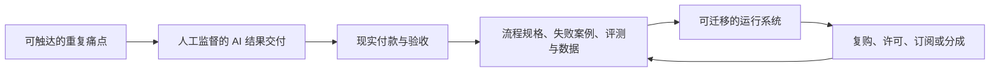

# 组合建议与现实验证

状态：独立研究初版结论。未与旧产出对照，旧产出不作为校准基准；没有把任何候选称为已验证生意。

## 先给当前结论

Javen 当前不应把未来押在“掌握某个 Agent 框架”，也不应等待一个完全自动、天然被动的资产突然出现。更合理的是同时经营不同账户：

- **现金流账户**：允许做普通、短周期、仍依赖本人但全成本划算的工作。
- **资产化账户**：先过大厂避让门，再探索“跨系统窄垂直结果代运营 + 数据准备 + 真实失败评测”的组合楔子。
- **长期期权账户**：围绕可靠自主系统、控制、物理 AI、制造或能源的现场集成与验证建立接入，不与云厂商或工业大厂重建平台。

最值得培养的不是孤立“人类技能”，而是一套**人和 AI 共同取得现实结果、保留控制权并把经验沉淀为资产的系统能力**。

## 为什么是这个组合

### 现金流不需要装成护城河

只要合法、全成本后划算、风险可控、不会吞掉全部注意力，普通服务就值得做。它可以与长期方向完全不同。拒绝它的唯一正当理由是机会成本和风险，而不是题材不够宏大。

### 资产化需要从服务学习，不应从通用产品想象开始

当前证据显示，企业的主要摩擦在流程适配、数据、准确性、安全、实施与运营，而通用 Agent 组件正在被平台内置。因此更合理的顺序是：

如果没有付款和复购，循环不会因为代码更漂亮而成立。

### 长期方向需要现实世界接口

可靠 Agent、身份权限、监控和评测会长期重要，但其通用部分会被平台化。Siemens、NVIDIA、Schneider 等也已经进入工业 Agent、数字孪生和能源协调层，因此物理 AI 不是“大厂不会做”的净土。相对稀缺更可能来自老设备、异构现场数据、设备接入、动力学、测量、安全、权限和合同。对 EE、ML、Controls 背景而言，这是一条有能力邻接性的长期假设；是否成立取决于能否进入实验室、工程团队或企业现场，而不是专业名称本身。

## 当前优先级

### 现在值得优先验证

**通过大厂避让门的窄垂直工作流产品化代运营。** 客户买一个跨系统、客户特有或责任明确的结果，Agent/Harness 只是后台。把数据质量、验收评测、权限、日志、人工升级和恢复设计成内部核心。

优先选择同时具备这些特征的流程：

- 重复发生，当前有人为它付出时间或钱；
- 输入、输出和验收可以描述；
- 错误可被发现和安全接管；
- 不需要一开始取得高风险执照或不可承受权限；
- 可以先用服务交付，不需先开发完整平台；
- 重复交付可能留下可合法控制的流程、评测、连接器或客户关系。
- 大厂或垂直 SaaS 加入原生菜单后，仍有不同的付款理由。

具体行业暂不拍脑袋决定。当前较值得查的是跨系统数据准备、异常运营、人工参与的无障碍修复、垂直质量与事故证据；电商、应收、文档和内容的标准步骤已经高度受 Shopify、QuickBooks、Microsoft、Google、Adobe 等平台挤压，只能调查其跨平台例外或按现金服务处理。真正首选仍取决于 Javen 能接触谁、能看见什么真实流程以及谁愿意给行为或付款证据。

### 可以并行寻找的现金工作

AI 增强的研究、软件、数据、营销、电商、行政或其他常规服务，只按以下条件判断：

- 真实可获得收入；
- 计入本人时间和所有费用后仍值得；
- 法律、隐私、退款和声誉风险受控；
- 不因大量定制与支持而挤掉更高价值实验；
- 对单一平台依赖是被看见并接受的，而非假装不存在。

如果它只挣钱，不沉淀资产，也可以接受。唯一要求是诚实记账。

### 作为长期研究期权保留

- 可靠 Agent 的评测、监控、身份、权限、恢复与人工接管；
- 垂直数据和真实反馈基础设施；
- 控制、数字孪生、物理 AI 与制造集成；
- 能源、柔性负载、冷却、储能与实际能效验证；
- 直接客户关系、可信案例与合同化收益权。

长期项目必须有独立里程碑，例如获得真实数据、现场接口、领域合作者、可复现实验或付费方访谈；不能因为短期不收费就免除外部证据。

### 当前不应优先投入

- 通用 PPT、文档、表格、Logo、图片、视频或内容生成工具；
- 先造通用 Agent 平台或泛 Harness；
- 复制 Shopify、QuickBooks、Salesforce 等现有平台原生动作的薄插件；
- 先造“自动找需求、自动开发、自动销售”的大系统，再等待市场证明；
- 没有分发与原创 IP 的内容农场；
- 只因能快速开发就开做的微型 SaaS；
- 把回测、内部完成度或 AI 自评当作稳定现金流证据；
- 把“被动收入”宣传当作资产定义。

## 真正值得培养的能力栈

这里不按“AI 能不能替代”划线，而按一项能力能否让整个人机系统取得、验证和保留价值来筛选。

### 需求与交易发现

- 识别现有替代成本、付款者、预算和采购触发点；
- 区分口头兴趣、行为投入、交易和复购；
- 用最便宜的反证实验避免长期自我说服；
- 让 AI 做行业扫描、访谈整理、竞争检索，人负责决定证据是否足以投入。

### 平台与竞争情报

- 在立项前查大厂和垂直 incumbent 的官方功能、发布状态、路线与套餐；
- 区分已正式可用、预览、试点、宣布与投资人预测；
- 识别平台拥有的账户、数据、权限、分发和 API 治理权；
- 用 AI 持续扫描变化，但由候选门禁决定是否暂停、降级为现金服务或退出。

### 工作流建模与结果测量

- 把现实流程拆成状态、输入、权限、动作、异常、验收和责任；
- 建立使用前基线与使用后结果，不用“感觉更高效”代替测量；
- 设计人工升级、回滚、停止和恢复路径。

### 可靠 Agent 与 Harness

- 模型和工具选择、上下文与记忆边界；
- 结构化输入输出、工具权限与身份；
- 评测集、回归、运行轨迹、监控、预算和故障注入；
- 人工接管、恢复、迁移与供应商退出。

学习目标不是背某个框架 API，而是能在框架更换后重建这些机制，并用真实失败证据判断可靠性。

### 数据、集成与权利

- 数据质量、来源、版本、许可、隐私和保留；
- API、数据库、业务软件与现实设备接口；
- 明确哪些数据、衍生物、客户关系、IP 和运行权由谁控制。

### 单位经济与价值捕获

- 把模型、托管、获客、支付、退款、支持、人工复核、税务和本人时间计入成本；
- 设计固定范围服务、托管、订阅、许可、共享节省或其他合同结构；
- 识别创造了价值但无法捕获价值的情况。

### 控制、实验与现实系统

- 状态估计、反馈、鲁棒性、故障与安全边界；
- 仿真到现实的差距、传感、执行器与测量；
- 把软件 Agent 的评测与控制系统的闭环验证连起来。

这部分不仅是一门传统专业技能，也是理解“自主系统如何在不确定环境里安全行动”的通用骨架。

## 现实验证流程

### 建立接入清单

列出 Javen 实际能够获得的，而不是网上看见的：

- 能谈到的企业、专业人员、实验室、学生组织或工程团队；
- 能经授权观察的重复流程；
- 能取得的脱敏样本、设备、日志或结果反馈；
- 能合作的领域、合规、销售或运营伙伴；
- 可使用的语言、地区和现有信誉渠道。

候选选择先由接入清单约束。没有接入，趋势再大也只是观察名单。

### 提交一页候选证据卡

每个候选只能提交：事实、推断、未知、付款者、大厂与垂直 incumbent、最强反方、最便宜反证、停止条件、风险簇和失败残值。内部开发计划不能替代这张卡。

### 先做问题与交易实验

- 取得一个经授权的真实流程样本；
- 先核验现有平台能做到哪里、客户为何仍需外部结果；
- 记录当前步骤、等待、错误、人工判断和现有成本；
- 做固定范围 teardown、诊断或 concierge 交付；
- 在接近现实的条件下请求付费诊断、订金或有约束的采购动作；
- 无交易证据时，不扩大工程投入。

### 再做重复与运营实验

- 在新的批次或独立客户上重复；
- 记录异常、人工介入、故障、支持与全部成本；
- 检查去掉折扣、新鲜感和创始人无限兜底后是否仍使用；
- 让替代操作者按运行记录完成一次交付；
- 实际演练模型、数据或渠道迁移与故障恢复。

### 最后才判断资产化

只有出现复购、控制权、全成本成立、可迁移性和创始人依赖下降，才讨论订阅、许可、分成或转让价值。否则继续作为现金工作，或停止。

## 每次实验必须留下什么

- 需求与付款证据，而非兴趣截图；
- 交付前后的可比基线；
- 完整成本和本人介入记录；
- 失败样本、异常分类和人工升级原因；
- 数据、IP、客户与衍生物的权利记录；
- 复用部分与客户专属部分的分离；
- 下一项能推翻项目的实验；
- 达到什么条件立即停止。

## 目前不制定比例

现金流、资产候选和长期期权的投入比例取决于 Javen 的现金储备、最低收入要求、可承受损失、学业安排、法律与声誉风险以及现有项目证据。当前没有这些事实，给出漂亮比例只会是假精确。

可以先采用非数量化原则：维持一个明确的现金流探索入口；只让拿到新外部证据的资产候选增加投入；给长期期权保留持续但受边界控制的研究与现实接入；限制共享同一平台、渠道或本人注意力的隐性集中。

## 对两个现有项目的处理：初始快照与当前更新

初始横向研究阶段没有读取旧项目文档，也没有依据旧产出给项目打分；当时提出的“下一次提供状态转储”已经完成，不再是当前待办。后续恢复只把旧文档当定位器和审计对象，当前权威是 [`08-活动状态.json`](./08-活动状态.json) 及其精确绑定 evidence。

- **机会到交易**：旧 schema/workspace 已隔离，未发现可继承的新运行时权威。CA012650 候选拥有持久公开源字节、确定性转换和复现记录，但它仍只是问题/路由假设。当前精确候选已取得绑定校验器、对抗测试和三份历史 FAIL 的 detached 独立 PASS，但该 PASS 不证明需求、付款、交付、利润、复购或资产价值。发送账户、观察截止、临发送源刷新和精确一次性用户授权尚未绑定，所以对外动作继续 fail closed。
- **投研纪律**：精确候选已被持久 bundle 绑定并能重建项目子树，完整治理 suite 的失败已由独立审查归类到具体 metadata、contract migration、stale receipt/freeze、shared-baseline cascade 与 fixture gaps，而不再是“完全未知的失败集”。但新 successor 尚未按这些根因修复、重跑或取得两份 candidate-bound 独立接纳；它仍是 paper-only、human-final 的 blocked_internal 研究候选，不是已恢复运行的投资系统，更不是收益资产。

后续不再重复索要整套项目说明，而是围绕 `08` 的未知、下一步和停止条件做增量刷新。只有新的现实行为、交易、复购、全成本、运行验收或独立收据能改变分类；代码更多、文档更完整或持久可重建本身不能升级现金流或资产结论。
