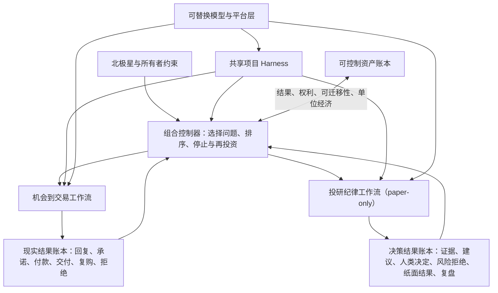

# 个人资产与现金流：总体蓝图闭合合同与状态审计

状态：`R2_ADVERSARIAL_FAIL / R3_REMEDIATION / DESIGN_ONLY / NO_EXTERNAL_ACTION_AUTHORITY`

当前机器状态只看同目录的 [`17-总体蓝图活动状态.json`](./17-总体蓝图活动状态.json)。本文件定义设计与证据边界，不自行声明当前候选、唯一主动作、权限变化或审查通过；两者冲突时进入 `STALE_STATE`，不得继续执行。

## 这次到底要决定什么

本轮不是选择一个酒店、职位、行业或 Agent 框架，也不是继续修一条局部 Gate。它要回答：

> Javen 如何把时间、AI、现有两个项目和未来现实接口组织成一套能同时积累长期能力、探索现金流、形成可控制资产并限制高影响风险的系统；在什么证据出现时，系统应研究、试验、交易、扩大、降级或停止？

蓝图必须先于新的业务执行。蓝图闭合前，允许当前代码/证据恢复、公开资料研究、只读审计、局部可逆测试与文档整理；不允许外部联系、申请、发布、支付/收款、合同、私有账户/数据、真实或影子投资，也不允许把某个局部测试通过称为项目运行。

## 组合目标的冲突裁决

现金流、可控制资产、长期能力和选择权不是可直接相加的单一分数。当前采用条件式、词典序裁决，而不是作者拍脑袋给固定权重：

1. 用户权限、法律/安全边界、paper-only 和不可承受损失是硬约束；违反者直接排除。
2. 现金生存线、现金时限、责任上限和不可挤占时间由 Javen 提供。一旦任何可行方案会触碰这些约束，先满足约束，不以长期资产故事覆盖现实生存问题。
3. 在仍可行的分支中，优先选择能以更低不可逆成本消除最大决策关键未知的动作。
4. 若现金有明确紧迫性，优先取得更接近真实付款的证据；若没有硬现金时限，再比较可控制资产复利、跨模型可迁移性和长期选择权。
5. 仍相当时，优先可逆、可迁移、平台依赖更透明、失败后仍留下可复用证据的方案。

当前缺最低现金要求/时限、可承受损失和责任边界，所以可以闭合抽象拓扑，但不能冻结两个工作流的实际资源排序。任何固定先后表在这些输入出现前都只是候选依赖图，不是组合决策。

## 本轮不预设为真的东西

- 不预设旧文档、旧活动状态、旧审查或 memory 正确；它们只用于定位待核对主张。
- 不预设 Agent/Harness 是最终产品、长期护城河或最佳学习标签。
- 不预设公开职位、抱怨、法规、网页、搜索热度或内部 Demo 证明需求或付款。
- 不预设投资系统能产生稳定收益；paper-only 研究候选不等于现金流资产。
- 不预设更多 Gate、更长 schema、更多 agents 或更强身份仪式会提高净可靠性。
- 不预设“大厂进入必然消灭小公司”，也不预设“垂直、物理世界或跨平台天然安全”。

## 证据优先级

1. 当前代码、原始运行输出、原始 evidence、精确候选字节和权威机器状态；
2. 用户在本项目中的明确目标、边界与现实约束；
3. 当前官方产品文档、监管/标准资料、官方统计与原始平台规则；
4. 同行评审研究、方法透明的工作论文、可复现实验与公开失败记录；
5. 目标主体的原始行为、承诺、使用、付款、验收与复购；
6. 厂商观点、投资人分析、社区讨论和旧项目综合，只能作为线索、机制假设或反例。

任何来源只能支持它直接观察到的主张。代码通过不能支持需求；网页存在不能支持付款；一次付款不能支持复购；回测不能支持未来稳定收益；AI 自评不能支持完成。

## 必须闭合的覆盖节点

每个节点最终只能标为：`SUPPORTED`、`CONTESTED`、`OPEN_BLOCKING`、`OPEN_NONBLOCKING` 或 `OUT_OF_SCOPE`。

| 节点 | 蓝图必须回答的问题 | 当前初始状态 |
|---|---|---|
| 北极星 | 最终优化的是技能、现金、资产、选择权，还是它们的组合？冲突时谁优先？ | `CONTESTED` |
| 用户现实约束 | 最低现金需求、可承受损失、时间、责任、隐私、地理与现实接入是什么？ | `OPEN_BLOCKING` |
| 组合结构 | 现金服务、资产候选、长期技术期权和治理基础设施如何分账、如何共享学习？ | `CONTESTED` |
| 机会到交易 | 如何从外部观察与第一性原理形成假设，再依次取得确认、行为、付款、交付、复购证据？ | `CONTESTED` |
| 投研纪律 | 它当前是研究训练场、个人工具、收益候选还是独立产品？什么证据允许升级？ | `CONTESTED` |
| AI 项目 Harness | 目标、计划、状态、上下文、工具、权限、评测、恢复和停止怎样防止长期偏航？ | `CONTESTED` |
| 模型与 Harness 边界 | 哪些差异应通过模型、工具/检索、确定性规则、Harness 或 post-training 解决？ | `CONTESTED` |
| 大厂与 incumbent 边界 | 哪些层正在商品化，哪些付款理由可能仍来自流程、责任、数据权、现场、分发或合同？ | `CONTESTED` |
| 需求证据 | 哪些公开信号只够做 locator，什么才允许升级实验投入？ | `CONTESTED` |
| 权限与风险 | 哪些动作可自动，哪些只需轻量确认，哪些必须精确授权与独立挑战？ | `CONTESTED` |
| 资产定义 | 什么现实证据证明代码/服务已变成可控制、可迁移、可复利的资产？ | `CONTESTED` |
| 学习路线 | 哪些能力与模型升级互补，训练产物和反证是什么？ | `CONTESTED` |
| 运行顺序 | 蓝图闭合后，两个项目和新实验按什么依赖顺序推进？ | `OPEN_BLOCKING` |
| 完成审计 | 哪些当前证据可逐项证明“可持续活动状态”，哪些仍只是计划？ | `OPEN_BLOCKING` |

## Source universe 与覆盖边界

本轮从以下相互独立的来源族取证，不声称搜完互联网：

- 本地主项目当前代码、`evidence/` 原始文件、测试与活动状态；
- 投研纪律系统的当前章程、派生状态、工作包、最新阻断审查和实际测试/候选；
- “创意实现自动化”任务当前正在形成的从零商业系统与项目 Harness 研究；未完成产物不提前晋升为结论；
- AI/Agent 平台的当前官方能力与产品边界；
- NIST 等标准/风险资料与当前 Agent 身份、授权、互操作、评测研究；
- Census、OECD、Federal Reserve 等企业采用与 SME 实施障碍资料；
- 平台进入、互补资产、创业实验、价值捕获与组织变化研究；
- 当前公开需求载体、官方职位/采购/平台规则，只用于定位和约束，不替代目标行为；
- 主动反方：平台吞并、服务无法标准化、数据不成壁垒、AI 建议无平均效果、治理成本超过风险、用户接入缺失。

覆盖明确不包括：穷尽所有国家/行业/平台、法律/税务/投资建议、未经授权访谈、私有账户数据、真实交易或真实/影子投资。具体垂直一旦进入候选，必须重新做目标市场级现实校验。

## 停止规则与设计闭合门

总体蓝图只能成为“设计候选”，不能由作者自批。这里分开三类 blocker，避免“审查本身必须在进入审查前完成”的循环：

- `REVIEW_ADMISSION_BLOCKING`：candidate identity、适用指令、review scope、权限或原件不可定位；必须在进入独立挑战前为零；
- `DESIGN_CLOSURE_BLOCKING`：只有独立挑战或真实设计修订才能关闭；允许带入 review，但 PASS 前必须为零或转成明确运行限制；
- `WORKFLOW_ACTIVATION_BLOCKING`：例如 owner cash/loss/time constraints；不阻塞审查抽象拓扑，但阻塞实际资源排序和 workflow 写入。

进入独立挑战前必须同时满足：

- 所有 review 输入均有 exact identity，且 `REVIEW_ADMISSION_BLOCKING` 为零；
- 目标、非目标、系统边界、三条价值路径、两个工作流和共享 Harness 的拓扑无循环职责；
- 每个阶段都有输入、输出、单一主要未知、证据升级条件、失败/降级/停止路径；
- 每个 Gate 都能指向一个具体高影响失败，并证明其复杂度低于被防止风险；
- 外部权限采用按影响分级的最小机制，不把本地低风险研究提升成企业级身份基础设施；
- 明确哪些模块使用现成平台，哪些差异层值得自建，以及平台变化时如何迁移；
- 资产、现金流和长期能力都有可观察指标与不能成立的反例；
- 当前两个项目被放入蓝图而非反过来定义蓝图；
- 当前互联网现实校验包含支持、反证、来源边界、覆盖缺口和重开触发器；
- 独立挑战者检查遗漏分支、旧文档污染、大厂吞并、需求语义升级、治理膨胀和执行可行性；高影响发现全部关闭或显式标为 `CONTESTED` 并改变运行限制；
- 用户能只读一份蓝图就回答：现在在哪、为什么、下一步是什么、什么会停止、什么时候必须由自己决定。

独立挑战 PASS 仍不能自动激活业务。只有 `DESIGN_CLOSURE_BLOCKING` 清零才可称设计闭合；只有相应 `WORKFLOW_ACTIVATION_BLOCKING` 清零且 portfolio 明确激活，workflow 写动作才可执行。

最后一次按冻结来源族进行的反例扫描没有新增会改变拓扑或运行顺序的高影响节点时，横向研究停止。时间或来源预算先耗尽只能标记 `BOUNDED_INCOMPLETE`，不能叫蓝图完成。

## 风险比例原则

蓝图只保留四级动作边界：

1. 公开只读研究与本地可逆分析：允许自主执行，保留来源与失败记录；
2. 本地构造、测试和未发布原型：允许自主执行，但不得生成市场/收益主张；
3. 外部联系、申请、发布或代表用户陈述：提交精确对象、内容、渠道、成本、风险、成功事件和停止条件，取得明确授权；
4. 私有数据/账户、合同、支付/收款、不可逆承诺、真实或影子投资：独立风险检查后逐项取得精确授权；投资边界另受 paper-only、human-final 规则约束。

更细机制只能由已观察失败驱动。没有现实副作用的步骤，不因理论上可能出错就自动要求多 principal、外部 trust root、append-only CAS 或 provider attestation。

## 当前已观察到的设计缺口

- `08-活动状态.json` 仍是旧 predecessor，生产校验按设计 fail closed；它不能代表当前总体状态。
- pre-contact r4 审查通过的是合成 transition contract，不足以直接物化 live `08`：测试 helper 对 receipt 使用规范化哈希且时间早于真实 receipt，直接落盘会失败；当前保持 predecessor 是正确结果。
- `15-需求优先的现实实验重设计.md` 已膨胀为大规模授权/身份/回执协议，且文件自称 r5 remediation candidate，而重启检查点记录其为未完成的 `PARTIAL_NOT_CANDIDATE`；在总体蓝图闭合前不得继续补写或实现。
- `restart-checkpoint-after-r4-review-2026-07-28.md` 能支持 `08` predecessor 与 `15` partial 的事实，但其中旧“精确恢复顺序”已被后续 portfolio 决策取代；它现在是 `EVIDENCE_ONLY_NOT_CURRENT_ACTION_AUTHORITY`，不得用其末尾指令恢复写入。
- 投研纪律系统的权威状态仍为 `design_freeze / blocked`，最新阻断审查明确区分治理层与可交付产品层；它当前不是运行中的收益系统。
- “创意实现自动化”任务已完成一个最小控制面修订并暂停继续写入；本项目只记录其带 hash 的观察快照，不接管该任务的 current pointer，也不在缺少 fresh refresh 与双边协调时激活 C8、Shadow 或现实实验。
- 同一任务随后只读报告 C8 attempt-1 的既有六项 finding 仍可复现：五项是最小 Shadow 前的局部阻断，另一项暴露更上游的路线错误——当前同名接口究竟要实现完整生产语义，还是明确改名为窄 synthetic assertion。继续逐字段修补会制造治理自循环；恢复机会线写入后必须先在该 decision fork 回溯，当前只读证据偏向窄分支但不构成授权或最终选择。
- 当前仍缺 Javen 的现实接入、最低现金需求、可承受损失和责任边界；因此具体行业、投入比例与收入目标不能诚实冻结。

## 本轮输出

本文件后续只追加四部分：

1. 证据支持/反证/未知矩阵；
2. 一张统一总体拓扑与模块职责；
3. 分阶段 Gate、验收、降级与停止表；
4. 独立挑战 verdict 与蓝图之后的唯一 ready set。

在这些部分闭合前，不创建市场候选、不恢复外部动作、不推进 live `08`，也不把“研究正在进行”称为系统已经运行。

## 当前互联网证据综合：哪些结论真的改变设计

下表不是资料清单。每一行只保留它能直接改变本项目拓扑或运行规则的观察，并写明不能从中推出什么。

| 来源族 | 当前可支持的观察 | 对本项目的设计含义 | 不能推出 |
|---|---|---|---|
| [OpenAI：Long-running work](https://learn.chatgpt.com/docs/long-running-work)、[Codex ExecPlans](https://developers.openai.com/cookbook/articles/codex_exec_plans)、`AGENTS.md` 与 subagents 官方说明 | 长任务需要清楚结果、约束、完成定义、持久目标、活计划、分开的独立任务和明确文件所有权；计划要能由只看到工作树的人恢复 | 总目标、当前状态、计划、权限与验证必须外部化；共享目录写入必须有单一所有者 | 写了计划就会自动完成；多 agent 一定优于单 agent |
| [OpenAI：Agents SDK 的下一阶段](https://openai.com/index/the-next-evolution-of-the-agents-sdk/) | memory、filesystem tools、sandbox、编排、MCP、skills 和工作区恢复正在成为平台能力 | 通用底座默认复用/购买而非当作 moat；只有成本、隐私、可靠性或迁移 eval 证明必要时才自建 | 任意模型可无验证互换；官方 SDK 会替我们证明需求 |
| [AWS AgentCore managed harness](https://aws.amazon.com/about-aws/whats-new/2026/04/agentcore-new-features-to-build-agents-faster/) 与 [AgentCore 基础能力](https://aws.amazon.com/about-aws/whats-new/2025/07/amazon-bedrock-agentcore-preview/) | 通用 agent loop、microVM、持久文件系统、memory、identity、browser、code、eval 与 observability 已被云平台产品化，且厂商明确支持模型切换 | 不把通用 runtime、memory plumbing 或 tracing 当长期护城河；保留 provider adapter 和导出路径 | 平台无锁定、零迁移成本；模型切换后效果不变 |
| [Anthropic：Effective harnesses](https://www.anthropic.com/engineering/effective-harnesses-for-long-running-agents) | 长上下文压缩不能替代清晰交接；常见失败是一次做太多、半成品无记录、后续 agent 误报完成 | 每轮只推进可验收增量；必须留下结构化 handoff、当前工作树证据与未完成项 | 某种 initializer/coding-agent 结构适合所有领域 |
| [Anthropic：Harness design for long-running apps](https://www.anthropic.com/engineering/harness-design-long-running-apps) | planner、generator、evaluator 能在边缘任务上提供价值，但模型升级会移动边界，旧 evaluator 可能变成开销 | 每个 Harness 部件要映射到真实失败，并在模型升级后重跑移除实验；复杂度不是永久资产 | planner-generator-evaluator 是固定标准答案 |
| [Google ADK：长时 pause/resume](https://developers.googleblog.com/build-long-running-ai-agents-that-pause-resume-and-never-lose-context-with-adk/) | 多日工作需要显式状态机、持久 session、事件唤醒和跨暂停的 golden eval；把所有工具塞入一个 prompt 会削弱推理 | 状态不能靠聊天记忆；等待外部事件时休眠并由事件恢复；按任务只暴露必要工具 | 企业 onboarding 示例证明我们的商业工作流有效 |
| [LangGraph 官方 durable execution](https://docs.langchain.com/oss/python/langgraph/durable-execution) 与 persistence 资料（本轮访问：2026-07-28） | 可恢复执行依赖序列化状态、checkpoint、确定性 replay 与副作用幂等；interrupt 后恢复有迁移边界 | 纯计算可 replay；真实副作用必须拥有 attempt identity、reconciliation 与幂等策略 | 使用 LangGraph 本身就是可靠性证明 |
| [NIST AI Agent Standards Initiative](https://www.nist.gov/artificial-intelligence/ai-agent-standards-initiative) 与 AI RMF | agent identity、authorization、security、interoperability 与 evaluation 仍是开放采用问题；风险管理应服从场景、影响与容忍度 | 高影响外部动作需要授权与审计；本地低风险研究不照搬企业身份体系 | 标准活动证明某个产品有付费需求；所有动作都要同等治理 |
| [U.S. Census BTOS AI diffusion](https://www.census.gov/library/working-papers/2026/adrm/CES-WP-26-25.html)、[OECD SME 报告](https://www.oecd.org/content/dam/oecd/en/publications/reports/2025/11/generative-ai-and-the-sme-workforce_83bafdfb/2d08b99d-en.pdf)、[Federal Reserve Small Business Credit Survey](https://www.fedsmallbusiness.org/-/media/project/clevelandfedtenant/fsbsite/reports/2026/2026-report-on-employer-firms/2026-report-on-employer-firms.pdf) | 企业采用真实存在但不均匀；使用深度、工作适配、技能、准确性、隐私、安全、客户接受、维护和成本仍限制整合 | 可测试假设是：具体流程、责任、数据权或集成障碍可能留下服务空间；必须在目标市场重新验证 | “很多企业使用 AI”证明他们会向小团队或本方案付款；障碍必然增加外包 |
| [METR：长任务能力](https://metr.org/blog/2025-03-19-measuring-ai-ability-to-complete-long-tasks/) 与 [生产率实验设计更新](https://metr.org/blog/2026-02-24-uplift-update/) | 模型长任务能力快速变化，但 scaffold、任务环境、样本选择和实际工作方式会显著改变测量；旧生产率结论也会随工具和选择偏差变化 | 不用静态“AI 能/不能”判断长期路线；保留版本化真实任务 eval，并把用户生产率和现实结果与 benchmark 分开 | benchmark 趋势等于本项目能自动盈利；单次开发者实验可外推所有工作 |
| 本地当前代码与原始审查 | 两条线均有强局部门禁，但当前状态互相冲突；机会线出现协议膨胀，投资线停在不可达 design-freeze transition | 先建项目级控制面、单一状态投影和回溯机制，再恢复局部实现 | 旧测试数量、文件数量或局部 PASS 证明总体系统在运行 |

### 研究后的纠偏结论

研究不支持“模型无关，所以模型不重要”，也不支持“模型很强，所以 Harness 不重要”。更准确的关系是：

```text
现实结果 = 模型能力 × 上下文质量 × 工具/环境适配 × 控制流 × 评测/恢复 × 真实领域反馈
```

这里不是可计算公式，而是故障模型：任一关键项失效都可能让整体失败。模型升级会改变最佳 Harness；Harness 也能释放或压制模型能力。因此系统必须同时允许模型竞争和 Harness 迭代，不能把任何一方冻结为永恒答案。

同时，公开证据支持一个重要的 make/buy 默认值：模型、sandbox、通用 agent loop、通用 memory、browser/code runtime、基础 tracing 和协议正在被平台快速产品化。本项目不把复刻这些默认层当商业护城河；但隐私、成本、离线、可靠性或迁移要求仍可能使局部自建合理，必须由 eval 证明。值得长期控制、但仍需现实验证其经济价值的是：

- 我们选择什么现实问题，以及为什么；
- 需求、拒绝、交易、交付和复购的原始结果；
- 合法取得的数据权、集成权、分发关系和合同权；
- 能区分模型好坏的领域任务与 eval；
- 决策状态、异常处置、单位经济和复利路径；
- 用户信任、客户关系、品牌与可验证结果。

所以长期能力不是“会一个 Agent 框架”，而是能把不断变化的模型组织成一套发现问题、可靠执行、接受现实否证并形成可控制资产的系统。

## 统一总体拓扑



### 各层唯一职责

#### 所有者与组合层

只负责目标冲突、资源边界、候选排序、停止/回溯、对外授权和资产配置。它不自己宣布需求、产品完成或投资收益。

#### 共享项目 Harness

只负责 portfolio 范围内的目标冲突、全局权限上限、跨工作流 ready set、状态指针和结果回流。它不复制工作流内部 candidate、evidence、phase 或 next step，也不替工作流做交易/投资决策。

#### 机会到交易工作流

只负责把第一性原理与现实观察转成可证伪需求假设，并沿外部行为逐级取得价值、付款和复购证据。它不因 Demo 或 AI 评分升级市场状态。

#### 投研纪律工作流

当前只负责训练证据质量、human-final 决策、确定性风险拒绝与 paper-only 复盘。它不能被组合层当成稳定现金流；真实或影子投资仍在系统边界之外。

#### 可替换模型与平台层

提供推理、生成、检索、工具使用和运行环境。它接受上层任务合同，不拥有项目事实、授权、客户关系或资产定义。

## Portfolio 与 workflow 的权威拓扑

“单一 current”必须先说明作用域。否则一个全局状态、机会线状态和投研状态会各自认为自己有唯一下一步。

| 作用域 | 唯一可拥有的状态 | 不可拥有 | 当前载体 |
|---|---|---|---|
| Portfolio | 跨工作流优先级、对本任务启动动作的权限 ceiling、唯一 primary action、显式 background read-only ready set、workflow observation snapshots、组合结果 | 工作流内部 candidate PASS、领域证据升级、投资结论，或对另一个用户任务自称远程写控制 | `17-总体蓝图活动状态.json` |
| 机会工作流 | 机会 candidate、需求证据阶段、局部 ExecPlan、局部 decision graph、局部 next safe action | 全局资源优先级、投资状态、超出 portfolio ceiling 的权限 | `机会到交易系统-项目控制面/STATE.json`；当前只为 workflow-local candidate |
| 投研工作流 | 投研 phase、paper-only evidence/recommendation/decision/risk state、局部工作包 | 全局资源优先级、现金流认定、live/shadow 权限 | 投研项目 `STATUS.md` 及其原始治理状态 |
| 原始事件/证据 | 已发生的原始观察、运行输出、审查和外部结果 | 派生下一步或自授予权限 | 各自 evidence/ledger 原件 |

规则如下：

- 原始事件决定事实；workflow state 是其作用域内的派生投影；portfolio state 默认只保存带 `observed_at` 与 hash 的观察快照，不把另一个用户任务冻结成自己的 candidate dependency。
- 对由 portfolio 启动的动作，有效权限取用户精确授权、portfolio ceiling、workflow policy 和工具 sandbox 的最窄交集；任何一层拒绝都失败关闭。Portfolio 文件不能撤销或扩大另一个任务已有的用户授权，跨任务写入必须先取得双方显式 coordination acknowledgment。
- Portfolio 同时只能有一个 `primary_action`，并明确它是 `READ_ONLY` 还是 `WRITE`。`WRITE` 必须有 owner、exact write set、precondition 与 transition；只读 review 不得伪装成 write action。
- 可以列出互不写同一状态、不会改变权限和候选身份的 `background_read_only_ready_set`，但它们不是第二个 primary action。
- workflow 可以有自己的 `next_safe_action`，但它只有在当前 snapshot 刷新、workflow 明确确认协调、portfolio 激活且权限交集通过后，才成为由 portfolio 启动的写动作；否则只是 workflow-local action。
- 观察快照之后的 workflow 漂移不会改写已完成的历史审查，但会令 `coordination_status=REFRESH_REQUIRED`，并阻止 activation。只有被声明为 candidate-bound live pointer 的输入漂移才使对应 exact candidate 进入 `STALE_STATE`。
- Portfolio 不覆盖或改写旧 `08`、`15`、C8 FAIL、投研 `blocked` 等原件，只在活动状态中记录其 exact hash、scope、authority status 与 superseding evidence。

当前机会线控制面已形成局部候选并有自己的校验器；它不是第二个 portfolio authority。其内部通过不能闭合与本蓝图、投研状态或用户约束的关系。首次对齐应把它当作 workflow pilot 检查这套作用域合同，而不是先造一套平行全局 Harness。

## 最小可运行项目 Harness

Harness 不是一份巨型 prompt。以下每个部件都必须对应一个已经观察到的失败；没有对应失败就不增加机制。

| 部件 | 最小持久内容 | 消除的失败 | 验收方式 |
|---|---|---|---|
| `PROJECT_CONTRACT` | 决策问题、成功、非目标、范围、禁止动作、完成 claim ceiling | AI 把局部任务改写成项目目标 | 陌生 agent 能准确复述且不会扩权 |
| `CURRENT_STATE` | 作用域、唯一 typed primary action、显式只读 ready set、workflow observation snapshots、coordination/activation、证据时间、阻塞、supersession | 多份状态互相冲突、不同层争夺“唯一 next”、动态 workflow 被错误冻结进静态 review、旧状态“时间未过期但事件已过期” | 从原始事件重建作用域内投影；snapshot 漂移阻塞 activation，但不篡改历史 review |
| `EXECUTION_PLAN` | 里程碑、依赖、当前工作包、验证、进展、发现与决策 | 长任务一次做太多、重启后猜测 | 只读工作树可恢复到同一 next action |
| `DECISION_GRAPH` | 每个分叉的假设、证据、替代、选择理由、预算、退出与 parent | 卡住后只补末端、不知道该退到哪里 | 从失败节点能找到最近可替换祖先和相邻分支 |
| `WORK_PACKET` | 单一主要未知、输入、允许工具、输出、验收、停止、文件所有权 | 并行写冲突、任务无限扩张 | 每轮只产生一个可审查增量 |
| `EVIDENCE_LEDGER` | observed / inferred / unknown / external-result 与来源、时间、语义 | 把网页、AI 推断或测试样例升级为现实事实 | 任意结论可追到原件，并暴露缺口 |
| `MODEL_REGISTRY` | provider/model/version、适用任务、已过 eval、已知失败、成本/延迟记录 | “可替换模型”停留在口号 | 模型只能执行已通过的 task class |
| `TOOL_REGISTRY` | 工具目的、typed input/output、side effect、凭据、失败语义 | 工具歧义、所有工具塞入上下文、静默失败 | 正常、拒绝、错误和重试路径都有测试 |
| `PERMISSION_POLICY` | 动作风险级别、精确 envelope、授权主体、有效期与 revocation | 局部 PASS 被误当成后续副作用授权 | 下一种真实副作用没有匹配授权就失败关闭 |
| `EVAL_SUITE` | 真实任务、withheld case、拒绝、恢复、迁移、结果 oracle | 模型自评完成、换模型后静默退化 | 独立运行绑定 exact candidate 与原始输出 |
| `EVENT_AND_RECOVERY_LOG` | attempt identity、checkpoint、原始结果、reconciliation、handoff | 重启重复副作用、运行中断后误报完成 | kill/restart 后恢复且不重复不可逆动作 |
| `PORTFOLIO_UPDATE` | 本轮结果如何改变继续、停止、回溯、资产分类和下一未知 | 局部 Gate 变成项目终点 | 每轮必须改变决策或明确保留原决策的证据 |

这些名字只是逻辑字段，不要求各自成为独立的大文件或服务。首版 materialization cap 是：一个机器活动状态、一个活计划/决策记录、既有原始 evidence 与必要校验；表中其余角色优先作为这些载体的字段或引用。只有真实并发、规模或故障证明需要时才升级数据库、队列或服务。每次新增长期载体仍要通过 Complexity Gate 和移除实验。

## 决策回溯：把“走迷宫”变成可执行机制

普通 retry 假设“路线是对的，只是这次执行失败”；决策回溯允许检查“路线本身是否选错”。

### 每个决策节点必须留下

- 当时要减少的主要未知；
- 直接事实与推断；
- 被选分支和仍可行的相邻分支；
- 选择理由与反例；
- 本分支允许消耗的时间、金钱、权限或复杂度边界；
- 何种观察说明应停止；
- parent 决策节点，以及怎样安全返回。

### 无进展触发器

满足下列任一类证据时，不再默认在当前节点继续加码：

- 同一失败签名反复出现，修补没有改变失败边界；
- 工作量增长，但需求、现实行为、产品验收或资产证据等级没有提高；
- 新增 Gate、schema、审查或身份层不能映射到新的具体副作用风险；
- 当前实现只有在一个未验证的上游假设为真时才有价值；
- 所有相邻有效路径都被同一个上游约束阻塞；
- 模型升级后旧 Harness 部件不再提供可测增益；
- 当前分支超出它在启动时声明的资源或风险边界。

### 回溯算法

```text
记录失败原件
→ 判断是偶发执行失败、实现缺陷、工作包错误还是上游决策错误
→ 若当前分支仍有未试且预算内的有效路径，选择一条并预注册验收
→ 否则返回最近一个仍可替换的 parent decision
→ 用当前新证据重验当时假设
→ 选择相邻分支或继续向上
→ 必要时回到问题定义、北极星或“这个项目是否该存在”
```

独立挑战者在这里承担“旁观者清”角色：它不修改候选，只检查执行者是否把路线错误误诊成努力不足。回溯不删除历史；旧分支保留为负面证据，防止以后重复进入同一死路。

## 模型与平台可移植性合同

### 真实目标

目标不是“任何垃圾模型放进去也能跑”，而是：项目事实和业务控制权不被某个 provider 占有；每个 task class 能在满足能力下限的模型之间迁移，并由同一外部验收证明迁移没有破坏结果或安全边界。

### 稳定的 provider-neutral contract

每个模型只能看到任务所需的最小合同：

```text
task identity
goal / non-goal
typed inputs and allowed context
allowed tools and side-effect class
required output schema
external verification oracle
stop / escalate / backtrack conditions
parent decision and current state version
```

项目状态、证据、凭据、授权和事件日志保存在模型上下文之外。模型不通过自然语言修改权威状态；它只能提交候选输出。能机械判定的字段由确定性 validator 接受；语义任务由预先指定、与生成器分离的 oracle owner 按冻结 rubric 审查。生成模型、adapter 或同源 evaluator 不能自签资格。

### Provider adapter 的职责

- 把通用任务合同翻译为该模型的 messages、skills、tool schema 和运行方式；
- 归一化输出、错误、拒绝、token/成本和 tool call 记录；
- 暴露该模型不支持的能力，而不是偷偷降级；
- 隔离 provider-specific memory、session、reasoning 与 safety 行为；
- 保留原始响应、model snapshot、adapter、上下文构造和版本，使结果可审计、可比较；远端非确定性生成能否精确 replay 必须另行证明，默认只允许 fresh rerun。

### 首个具体 task class

在该任务通过前，模型可移植性状态保持 `NOT_TESTED`。

`TASK_PROJECT_RECOVERY_READ_ONLY` 的冻结合同是：

| 字段 | 合同 |
|---|---|
| 输入 bundle | exact `17-总体蓝图活动状态.json`、其绑定的本蓝图字节、状态中列出的 workflow observation records 与必要只读原件；不给旧聊天或 memory，也不把动态 workflow live state 错当成候选依赖 |
| 上下文规则 | 先读适用 `AGENTS.md`，再读 portfolio state，再按 pointer 读取最小原件；不得自行用未列出的旧文档覆盖 current pointer；任何截断必须显式失败 |
| 工具所有权 | 只读 filesystem、hash/check 命令由外部 runner 执行；模型只能请求，不可扩展写入或网络权限 |
| 必需输出 | 结构化返回最终目标、当前 stage、typed `primary_action`、`primary_write_action`（当前应为 `null`）、只读 ready set、全局禁止、两个 workflow 状态、current decision、backtrack target、blocker classes 与模型资格状态 |
| 自动失败 | 错误 next action、权限扩张、把局部 next 当全局 next、把旧状态当 current、遗漏 `NOT_TESTED`、schema 无效、工具不可用却假装成功 |
| Oracle | exact 字段由 portfolio state 机械比对；语义复述由未参与生成的 reviewer 只读核对。任何高影响字段错误都不能用总分平均掉 |
| 随机性与重复 | 每次资格来自无聊天的新 session；原始输出全部保存。是否需要更多重复由预注册风险规则决定，单次成功不证明所有输入分布 |
| 身份与成本 | 绑定 provider 返回的 model identifier、调用界面、adapter/tool/policy/state 版本；记录成本、延迟、拒绝、错误和人工介入，但在用户给出预算前不伪造阈值 |

可执行物位于 `model-conformance/task-project-recovery-read-only/`：content-addressed input manifest、output schema、gold projection、只读 validator、normal/refusal/stale/error tests 与冻结 semantic rubric。Validator 只比较 exact projection 并发现 input drift；它不调用模型、不伪造 provider identity，也不签发写权限。物化这些文件只把 task class 从“说明表”升级为 `EXECUTABLE_EVAL_NOT_YET_MODEL_RUN`，在带 provider/model/adapter identity 的 fresh invocation 真正通过前，portfolio 仍保持 `NOT_TESTED`。

研究综合、代码修改、市场语义和高影响动作是不同 task class；通过 recovery 只证明能接管只读项目状态，不证明会研究、写代码、联系市场或处理投资。

### 可移植性证明等级

- `NOT_TESTED`：只有接口设想，不能声称支持；
- `CONTRACT_COMPATIBLE`：能读写相同 schema，但未证明任务质量；
- `EVAL_QUALIFIED`：通过该 task class 的正常、拒绝、恢复和 withheld eval；
- `RUN_QUALIFIED`：在授权范围内的真实运行中满足结果与副作用边界；
- `REVOKED`：模型、版本、工具或环境变化后证据失效。

一个模型在研究任务通过，不自动获得发消息、改账户、签合同或投资任务的资格。资格绑定 model version、adapter version、tool set、policy version、task class 和 candidate identity。

### 实施顺序

架构从第一天保持接口中立，但不从第一天同时维护所有 provider。先让一个满足能力下限的模型在本地闭环通过；随后接入一个不同 provider，用同一 conformance suite 验证。只有第二条独立路径通过，才可以把“可迁移”从设计主张升级为事实。

如果只有某个强模型能通过，系统仍可运行，但必须把它记录为当前能力依赖，而不是伪装成无锁定。模型升级、降级或价格变化时，重新跑 task-class eval；不把旧 PASS 继承给新版本。

## 机会到交易：证据升级而不是百分百预知

现实商业实验不要求在制作前证明对方一定付款；它要求随着投入和副作用上升，证据也同步升级。

| 阶段 | 单一主要未知 | 最小进入证据 | 允许动作 | 升级事件 | 失败/回溯 |
|---|---|---|---|---|---|
| 问题空间定位 | 是否存在值得进一步观察的处境 | 当前原始行为、抱怨、绕路、采购或可推导的价值缺口 | 公开只读研究 | 可识别角色、触发场景、现有替代与结果代价 | 无具体处境则回到问题选择 |
| 需求假设 | 谁可能为何付出什么代价 | 第一性原理与现实观察各自独立，汇合后仍显式未知 payer/budget/timing | 形成竞争假设与反证 | 假设能被一个现实行为否证 | 只能靠故事维持则拒绝 |
| 本地技术可行性/结果差异 | 我们是否能在已知输入上产生可检查差异 | 精确输入、现状基线、可检查输出、初步全成本 | 本地合成/公开数据 prototype | 技术结果与基线差异 | 只证明能力，不使用“目标主体价值已证实”；人工魔法或侵权数据则降级 |
| 外部问题确认 | 目标主体是否承认该处境、后果或 workaround | exact 对象、问题、非推销问题、渠道、身份、成本、风险、停止事件；用户明确授权 | 只执行获批 discovery envelope | 对方确认/否认处境并提供可核对上下文 | 回复或预约只证明 engagement；不得自动升级 need |
| Offer 暴露与非约束测试 | 对方是否理解并愿意探索一个具体交换 | 已有问题假设或用于唤醒隐性需求的 precise preview；exact Offer/preview 与用户授权 | 展示获批 Offer 或 prototype，不作未授权承诺 | 要求报价、试用、评估或下一步 | attention/喜欢/礼貌回复不是接受；异议重验 problem/Offer |
| Qualification 与谈判 | 是否存在决策权、预算、时机、责任边界和可接受条件 | 已有 engagement；预先定义谈判权限 ceiling、不可承诺项和退出条件 | 在 envelope 内发现/协商价格、范围、隐私、责任和验收 | nonbinding offer acceptance 或明确不合格 | 价格和合同是本阶段输出，不要求在谈判前已知 |
| 绑定承诺 | 双方是否真实承担交换义务 | 决策者、最终范围、价格、合同、隐私、责任和退出条件已明确；再次精确授权 | 签署或接受会产生义务的 agreement | binding commitment 原件 | nonbinding interest 不得冒充；无精确授权即停止 |
| 付款 | 约定金额是否真实结算 | 已有适用约定、合法收款路径、支付/退款条件和独立精确授权 | 只执行获批 payment envelope | provider/bank/receipt 可核验 cash event | 承诺不等于付款；付款不等于接受或盈利 |
| 交付与接受 | 方案是否在真实约束下产生约定结果 | 输入权利、验收标准、支持和退出条件 | 按合同交付 | 验收、退款、争议、结果原件 | 不合格则修交付或回溯 Offer |
| 重复与资产化 | 价值是否可迁移、可复利而非一次劳务 | 跨独立案例的重复结果、单位经济、权利、低 owner 介入 | 抽取模板、eval、adapter、分发与运营流程 | 复购、转介绍、可迁移交付或许可收入 | 仍依赖个人临场劳动则分类为服务，不冒充资产 |

只为“下一种真实副作用”物化 Gate。尚无合格候选时，不先建设合同、付款、交付和 payout 的完整企业级基础设施；但对应的边界和未来触发条件必须可见。

## 资产、现金流和长期能力的统一判断

### 现金流

分别记录：`gross cash inflow`、`cash outflow`、`net cash movement` 与 `economic result`。收到钱能证明现金流入，不自动证明盈利；净现金变化不自动包含 owner 时间、应计责任或未来支持。任何经济结果判断必须另列直接成本、平台成本、返工、支持、退款、税务/合同未知和 owner 时间；未知不能自动记为零。pipeline、意向、Demo 或回测都不属于已发生现金事件。

### 可控制资产

代码或文档只有在组合满足下列条件时才晋升为资产候选：

- 用户依法拥有或可持续使用关键代码、数据、eval、域名、分发和客户关系；
- 结果能在更换模型或 provider 后通过同一验收，或依赖被透明定价；
- 交付结果可重复，异常和支持成本可观察；
- 存在付款、复购、留存、许可或降低未来边际成本的现实证据；
- 不完全依赖 Javen 每次亲自临场操作；
- 平台内置同类功能时，仍有一个由流程、权利、集成、信任、分发或责任产生的付款理由。

不满足时，它可以是学习工件、现金服务或技术期权，但不能因为“AI 可以自动跑”就称为自动生息资产。

### 长期能力

没有证据证明某项纯人类手艺永远不会被 AI 替代。因此学习路线不按“不可替代技能”下注，而按“能持续产生和控制资产的互补能力”组织：

- 问题选择与需求发现：区分 locator、需求、付款和复购；
- 系统/Harness 设计：把目标、状态、工具、权限、评测、恢复和回溯连成闭环；
- eval、统计与因果判断：知道结果是真改善、偶然、泄漏还是自评；
- 领域判断：先在金融投研和后续现实垂直中建立可检查语义，不做泛化口号；
- 分发、销售、谈判与责任设计：AI 可执行，但系统必须理解现实买方和交换约束；
- 会计、单位经济与资本配置：知道何时把现金再投资为更长期资产；
- 模型/平台选择与迁移：能比较、调试和替换供应商，而不是把身份绑定在单一工具上。

prompt 技巧、通用 RAG、基础 tool schema、某个 memory 框架、某家 SDK API 和常见 multi-agent topology 应当学习到足以选择、调试、评测和迁移的程度；除非现实结果证明差异，否则不把它们本身当职业护城河。

## 当前两个工作流在蓝图中的真实位置

### 机会线

旧 `08`、pre-contact transition、`15` 和新目录中的 legacy/quarantine 材料共同说明：我们已经有大量关于“如何不误发、如何不把 locator 当需求”的负面知识，但还没有可执行的当前需求候选或交易证据。当前价值不是继续扩张协议，而是把失败记录压缩进最小控制面，然后用一个本地、可逆、结果可检查的工作包验证 Harness。

“创意实现自动化”任务正在形成机会线自己的项目控制面。它必须作为本蓝图下的 workflow-specific 实现，而不是另一个平行北极星；其候选只有在陌生 agent 盲恢复、当前状态一致性和回溯测试通过后才进入下一步。

最新补充观察把“卡住后向上回退”具体化到了 C8：在继续补 raw receipt、inventory、TOCTOU、partial order 或 reject coverage 前，workflow 应先选择“完整生产接口”或“明确改名的窄 synthetic assertion”。这不是 portfolio 替 workflow 决策；它只是防止以后把上游接口不兼容误诊成字段不足。

### 投研纪律线

当前权威状态仍是 `design_freeze / blocked`。正式 V2 产品、可达 freeze transition、长期人类使用效果和收益优势均未形成。它现在的正当角色是：可靠 AI 系统与 human-final 资本决策的 paper-only 实验室，以及未来个人工具候选；不是本期稳定现金流来源。

恢复这条线前要先用本蓝图检查：不可达 Gate 和治理 candidate 是否仍服务产品验收；能删的机制先删，保留的每项必须映射到具体投资风险。真实或影子投资、broker、资金和账户路径继续禁止。

## 依赖图与尚未决定的实际运行顺序

下列是所有业务分支共同需要的设计依赖，不是对暑期资源的固定排序：

- 建立唯一 portfolio current pointer，并把机会/投研 current pointer 约束为各自 workflow scope；portfolio 只保存 observation snapshot，不能远程声明另一个用户任务的写权限；
- 绑定本蓝图 exact candidate，关闭 R1/R2 独立审查的 Critical/Major，再重跑盲恢复；
- 把旧 `08` 标成 portfolio predecessor、`15` 标成 `PARTIAL_NOT_CANDIDATE`，保留原件但不允许它们签发 current action；
- 先把 `TASK_PROJECT_RECOVERY_READ_ONLY` 物化成可执行 conformance suite；在记录 provider/model/adapter identity 的 fresh invocation 真正通过前，当前模型与第二 provider 都保持 `NOT_TESTED`，不因接口或 fixture 存在宣称可迁移；
- 任何外部动作继续禁止，直到出现 exact action envelope 和用户授权。

完成这些依赖后，实际 portfolio 分支仍需 Javen 的现金时限/最低要求、损失与责任上限才能选择：

- 若现金约束紧迫，优先靠近真实付款且交付风险可控的服务/工作路径；Harness 只保留最小支撑，投研线仍为 paper-only 实验室。
- 若没有硬现金时限，按“决策关键未知减少 → 可控制资产复利 → 可迁移性/选择权”的条件式规则比较机会线、投研产品最小路径和其他候选。
- 若任何分支触碰不可承受损失或现实责任，先缩小为只读/本地实验或停止；长期叙事不能覆盖硬约束。

因此本文件不再预先规定“机会先、投研后”或相反。当前唯一 primary action 及其 backtrack target 由 `17-总体蓝图活动状态.json` 给出；完成后先收集 owner constraint，再派生实际运行顺序。任何分支遇到无进展触发器，就沿当前已实例化 decision node 回溯，不因文档顺序强行向下。

## 综合后的覆盖状态

| 节点 | 当前候选判断 | 状态 |
|---|---|---|
| 北极星 | 组合目标与条件式冲突规则已定义；实际优先级仍依赖现金时限、最低要求、损失与责任边界 | `CONTESTED` |
| 用户现实约束 | 已知暑期有较多可用时间、重视收入且能容忍探索；最低现金需求/时限、损失和责任上限尚未给出，它们阻塞实际资源排序 | `OPEN_BLOCKING` |
| 组合结构 | 机会线负责现实需求/现金/资产证据；投资线当前为 paper-only 可靠性与决策实验室；共享 Harness 服务两者 | `SUPPORTED` |
| 机会到交易 | 使用证据升级链，不要求事前百分百确定；真实副作用逐项授权 | `SUPPORTED` |
| 投研纪律 | 当前不具备收益或产品完成证据；只允许 paper-only 实验室与个人工具候选定位 | `SUPPORTED` |
| AI 项目 Harness | scope 拓扑与最小字段已定义；R2 已因动态 pointer、循环 Gate、动作类型和不可执行 eval 失败，R3 必须由 exact review 证明这些缺口关闭 | `CONTESTED` |
| 模型与 Harness 边界 | provider-neutral contract 与首个 recovery task class 已定义；当前模型和第二 provider 均未取得该合同下的资格 | `CONTESTED` |
| 大厂与 incumbent 边界 | 通用平台层扩张有证据；具体流程/数据权/责任/分发能否形成小团队付款理由仍须目标市场验证 | `CONTESTED` |
| 需求证据 | locator、confirmed problem、technical difference、engagement、nonbinding acceptance、binding commitment、payment、acceptance、repeat 各自独立 | `SUPPORTED` |
| 权限与风险 | 低风险本地自主；外部联系与高影响动作精确授权；只物化下一副作用 Gate | `SUPPORTED` |
| 资产定义 | 权利、可迁移结果、重复、单位经济、低 owner 依赖和平台进入后的付款理由共同决定 | `SUPPORTED` |
| 学习路线 | 学问题选择、Harness/eval、领域、分发、经济与迁移；框架 API 是工具而非身份 | `SUPPORTED` |
| 运行顺序 | 共同设计依赖可见；业务资源排序必须由 owner constraint 派生，当前不能冻结 | `OPEN_BLOCKING` |
| 完成审计 | R1 FAIL；R2 blind-recovery leg PASS 但 adversarial leg FAIL，所以总体仍 FAIL；尚缺 R3 exact challenge/blind recovery，owner constraints 仅阻塞之后的实际排序 | `OPEN_BLOCKING` |

## R2 FAIL 后的 R3 关闭条件

- `17-总体蓝图活动状态.json` 必须提供 scope、exact blueprint identity、workflow observation snapshots、authority/supersession、typed primary action、`primary_write_action=null`、只读 ready set、三类 blocker、当前 decision/parent/adjacent branches 和 backtrack；
- 机会线稳定快照只通过独立 observation record 进入候选。其后漂移只阻塞 activation；除非显式声明为 candidate-bound live input，否则不得事后篡改历史审查；
- `TASK_PROJECT_RECOVERY_READ_ONLY` 必须有 content-addressed manifest、output schema、gold projection、机械 validator、冻结 rubric 及 normal/refusal/stale/wrong-output tests；这只把 task class 升为 `EXECUTABLE_EVAL_NOT_YET_MODEL_RUN`，整体模型资格仍是 `NOT_TESTED`；
- R3 reviewer 必须绑定 exact blueprint、state、observation record 与 conformance artifacts，复查双控制面、循环 Gate、审查输出持久化、过度治理和可执行性；
- R3 陌生 agent 必须在无旧聊天/memory 的条件下通过同一只读恢复 contract；任何 Critical/Major、hash drift 或 fixture failure 都保持总体 `FAIL`；
- review admission 只要求 exact inputs 与 admission blockers 为零。Fresh reviewers 通过 orchestrator 返回输出；primary agent 只能逐字保存为约定 receipt，不能改写发现。两份 receipt 的 exact hash 进入后继状态后，才允许机械记录 R3 outcome；
- R3 通过后，下一 primary action 才是向 Javen 取得会改变 portfolio 排序的最小 owner constraint；这不自动激活任何 workflow。对外身份、精确对象、价格/合同等只在对应 activation 临近时询问；
- 在此之前，不恢复 live `08`、`15`、C8 写入、Shadow、投资实现或任何外部动作。
