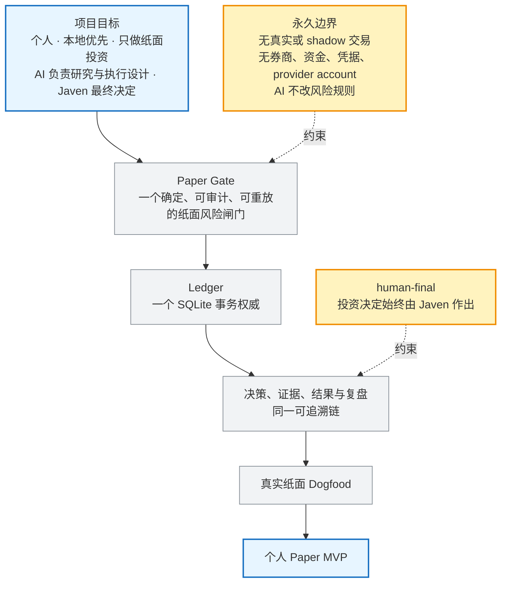
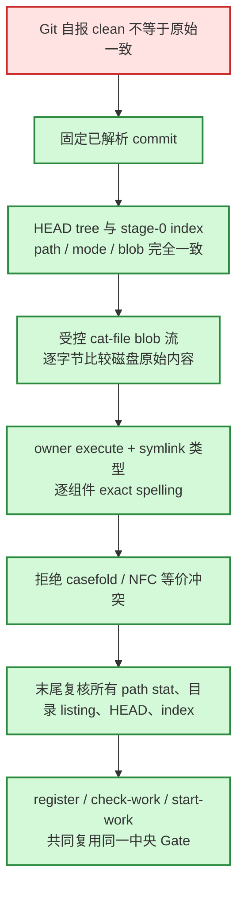

# 投研纪律系统｜当前进度

> 给 Javen 查看进度的只读窗口。它不决定路线、不授权执行、不构成验收；权威路线仍由项目内 Mission Graph 与 Product Capability Graph 控制。

## 一眼看懂

```mermaid
flowchart LR
    B["✅ 已接受基线<br/>15b9d742 · Paper Gate stalled"] --> D["✅ 整数权威方向<br/>fresh review PASS"]
    D --> G["✅ Graph 候选<br/>12 / 12 paths"]
    G --> X1["✅ 跨 clone 唯一性<br/>本机 registration"]
    X1 --> X2["✅ 启动原子性<br/>register / check / start"]
    X2 --> X3["✅ 原始仓库身份<br/>HEAD ↔ index ↔ literal bytes + mode"]
    X3 --> V["✅ 完整验证<br/>Graph 75 + 75<br/>Prototype 95 + 95"]
    V --> R(["◐ 当前关口<br/>全新 mutable prefreeze review"])
    R --> C["○ 冻结 exact candidate C"]
    C --> F["○ Fresh exact-object review"]
    F --> A["○ 单收据 activation A"]
    A --> REG["○ 本机 authority registration"]
    REG --> START["○ check-work → start-work"]
    START --> P["○ Paper Gate 整数权威实现"]
    P --> L["🔒 Ledger SQLite authority slice<br/>当前仍 BLOCKED"]

    classDef done fill:#d3f9d8,stroke:#2b8a3e,stroke-width:2px;
    classDef current fill:#e7f5ff,stroke:#1971c2,stroke-width:3px;
    classDef pending fill:#f1f3f5,stroke:#868e96;
    classDef locked fill:#ffe3e3,stroke:#c92a2a,stroke-width:2px;
    class B,D,G,X1,X2,X3,V done;
    class R current;
    class C,F,A,REG,START,P pending;
    class L locked;
```

**现在的位置：** Graph 候选已经实现并完成完整回归，但还没有冻结。下一步是由一个未参与构造的 reviewer 对当前 mutable 12-path 候选做最终预冻结审查。只有它返回 `GO` 且 `critical=0`、`major=0`，才会冻结 C；现在不能进入 Ledger。

## 项目目标与产品主路径

## 当前事实

- 更新时间：`2026-07-31T02:50:26-07:00`
- 当前阶段：`INTEGER_AUTHORITY_GRAPH_READY_FOR_FINAL_MUTABLE_PREFREEZE`
- Graph 当前节点：`CAP-PAPER-GATE-INTEGRITY`
- 当前候选工作：`WORK-PAPER-GATE-INTEGER-AUTHORITY-R1`
- 当前义务：`OBL-PAPER-UNIQUE-COMMIT-SINK`
- 当前执行状态：`mutable_candidate`；`candidate_valid=true`；`execution_authorized=false`
- 当前 accepted authority：`Paper Gate = STALLED`；`Ledger = BLOCKED`
- 候选写集：方向审查要求 `12 paths`；实际 `12 paths`
- 已接受基线：commit `15b9d74221d045a65a66b56d5a3f0ada9d541c58`；tree `1addfffdad4f89746fc4d55ae09964286a53056c`
- 项目级启动规则已经写入 `AGENTS.md`：`12978 bytes`；SHA-256 `ffe45f8a9be06f45b8b68db370d8e7b6da24f3fbc6e4cc4723c1a0a848e018c5`
- 安全边界保持：`personal/local-first/paper-only/human-final`
- 生产 registration：不存在
- 生产 attempt ref `refs/ids-attempts/paper-gate-integer-authority-r1`：不存在
- Ledger 产品写集：`NONE_AUTHORIZED`

## 本轮已经闭合

- clean filter、repository-local attributes、fsmonitor 与 Git stat cache 都不能再把 tracked raw-byte 漂移伪装成可启动状态。
- registration 使用固定机器本地 authority；普通 clone 不能复制执行资格。
- `register-authority` 不授权；`check-work` 仍输出 `execution_authorized=false`；只有一次成功的 `start-work` 能原子消费 attempt ref。
- review receipt 使用精确 JSON 类型比较，不接受 `12754.0 == 12754` 一类 bool/int/float 混淆。
- raw-identity 独立代码审查：`GO — C0 / M0 / m1`。唯一 minor 是把 NFC/NFD 场景固化成测试；随后该回归已加入并以 `1 test in 0.751s`、`OK` 通过。

## 验证证据

- Graph，`PYTHONINTMAXSTRDIGITS=640`：`75 tests in 419.896s`，`OK`
- Graph，`PYTHONINTMAXSTRDIGITS=0`：`75 tests in 424.443s`，`OK`
- Prototype，`PYTHONINTMAXSTRDIGITS=640`：`95 tests in 3.258s`，`OK`
- Prototype，`PYTHONINTMAXSTRDIGITS=0`：`95 tests in 2.738s`，`OK`
- 最新完整 activation 集成：`1 test in 371.931s`，`OK`
- Product 与 Mission 的 `check`、`check-view`、`check-candidate`：PASS
- Ruff：`All checks passed!`
- Ruff format：`4 files already formatted`
- `git diff --check`：PASS
- tracked `prototype/**` diff：空

## 冻结前还缺什么

1. 全新 reviewer 对当前完整 mutable 12-path source、tests、Graph、handoff/decision 绑定做预冻结审查。
2. 只有 `GO / critical=0 / major=0` 才冻结 exact candidate C。
3. 冻结后再从完整 `--no-local`、non-promisor clone 做 exact-object fresh review。
4. 通过后才创建只增加一份 review receipt 的 activation A。
5. A 在 handoff 指定的唯一 Git common directory 完成本机 registration、`check-work` 和一次 `start-work`。
6. `start-work` 成功后才允许 Paper Gate 产品文件首次移动；Paper Gate 完成并验收后，Ledger 才能解锁。

## 权威入口

- 项目工作规则：`AGENTS.md`
- 全项目路线：`governance/PROJECT_MISSION_GRAPH_V2.json`
- 产品能力依赖：`governance/PRODUCT_CAPABILITY_GRAPH_V1.json`
- 当前候选边界：`governance/PAPER_GATE_STATE_MACHINE_BOUNDARY_V3.json`
- 方向提案：`governance/evidence/PAPER_GATE_INTEGER_AUTHORITY_DIRECTION_R1.proposal.json`
- 方向审查：`governance/evidence/PAPER_GATE_INTEGER_AUTHORITY_DIRECTION_R1.fresh-review-pass.json`

本页只在阶段切换、候选冻结、fresh review 完成、真实阻塞或项目完成时更新。
