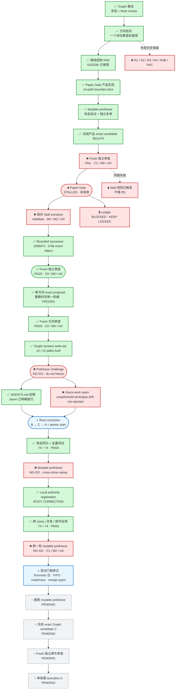

# 投研纪律系统｜当前 Graph

> 这是给 Javen 查看进度的只读窗口。它不决定路线，也不构成验收；权威路线仍由冻结的 Mission Graph 和 Product Capability Graph 控制。

## 现在在哪

一句话：项目未完成；旧实现继续 rejected/stalled，新“整数时间单一权威”方向已获 fresh PASS。首轮 mutable prefreeze 发现的跨 clone 重放根因已经关闭；新一轮挑战又发现 fsmonitor 可隐藏 tracked 漂移、特殊登记文件会阻塞，以及 crash/concurrency 证明不足，因此候选仍是 NO-GO。当前正在启动门同一层做根修正。尚未冻结 C、尚未 fresh exact review、尚未生成 activation A，也没有运行 `start-work`。当前 accepted authority 仍是 Paper stalled、Ledger blocked；prototype 没有新授权。

## 项目目标与产品主路径

## 当前状态

- 更新时间：`2026-07-31T01:23:28-07:00`
- 执行状态：`INTEGER_AUTHORITY_GRAPH_GATE_HIDDEN_INDEX_AND_RECEIPT_TYPE_ROOT_CORRECTION`
- Graph 当前节点：`CAP-PAPER-GATE-INTEGRITY`
- 当前工作项：`WORK-PAPER-GATE-SINGLE-STATE-MACHINE-R1`
- 当前义务：`OBL-PAPER-UNIQUE-COMMIT-SINK`
- 当前路线状态：`Paper Gate = STALLED；Ledger = BLOCKED；execution_authorized = false`
- 未接受的 Graph 候选内部工作：`WORK-PAPER-GATE-INTEGER-AUTHORITY-R1`
- 候选实际写集：`12 paths`；方向审查要求的最小写集：`12 paths`
- 已关闭的权限阻塞：Javen 已明确允许更新本项目 `AGENTS.md`；当前文件为 `12978 bytes`，SHA-256 `ffe45f8a9be06f45b8b68db370d8e7b6da24f3fbc6e4cc4723c1a0a848e018c5`。
- 当前启动协议：mutable overlay 与冻结 C 只能通过非授权 `check-candidate`；只有 fresh-reviewed C 的单收据 activation successor A 才能先登记唯一机器本地 authority。登记仍不授权；已登记 A 的 `check-work` 仍输出 `execution_authorized=false`；只有 `start-work` 原子创建唯一 attempt ref 后才可输出 true。
- 当前 smoke 证据：Product 与 Mission `check`、`check-view`、`check-candidate` 均 PASS 且 `execution_authorized=false`；mutable candidate 的 `register-authority`、`check-work`、`start-work` 均 exit `1`，生产 registration 与 attempt ref 均不存在。
- 已通过的攻击面：候选与 activation 的仓库外夹带提交、tracked/untracked/ignored prototype 漂移、`assume-unchanged`/`skip-worktree` 隐藏索引位、未注册 A、普通 no-local clone 重放、并发登记、非 canonical/未知字段/截断/重复键/类型混淆/symlink/错误权限/额外 hardlink 的登记损坏、错误 attempt ref 和已消费 ref 重放。
- 完整 Graph 回归：`PYTHONINTMAXSTRDIGITS=640` 下 `74 tests in 153.530s`，`PYTHONINTMAXSTRDIGITS=0` 下 `74 tests in 149.479s`，均 `OK`。
- 完整 prototype 回归：`PYTHONINTMAXSTRDIGITS=640` 下 `95 tests in 1.715s`，`PYTHONINTMAXSTRDIGITS=0` 下 `95 tests in 1.697s`，均 `OK`。
- Mutable prefreeze：`NO-GO`；`critical=1`、`major=1`、`minor=0`。根因是 attempt ref 只在一个 Git common directory 内唯一，普通 clone 不携带它，因此跨 clone 仍可能重新启动。
- 最新 mutable prefreeze：`NO-GO`；`critical=1`、`major=2`、`minor=0`。Critical 是 fsmonitor-valid + 仓库 hook 可把 tracked 漂移伪装成干净树；Major 是 FIFO 型 registration 会阻塞，以及原 hardlink 发布存在 crash wedge 且缺并发 start/register-vs-start 证据。
- 根修正 closure review：`NO-GO`；`critical=0`、`major=1`、`minor=0`。实际 dirty-tree 授权绕过、FIFO 阻塞和 crash/race 已关闭；剩余问题是强制 `core.fsmonitor=false` 也让 `ls-files -f` 看不到一个没有实际 drift 的 fsmonitor-valid 隐藏位，未兑现“任何隐藏 index 状态失败”。
- Fresh mutable challenger：`NO_GO`；`critical=0`、`major=1`、`minor=0`；`user_decision_needed=false`。整数权威方向仍有效；剩余问题是 activation review receipt 对 `bytes` 的 float/int 使用普通 Python equality，可能接受 `12754.0 == 12754` 的标量类型混淆。
- R1 失败快照：`294e92b2d53c024dd99d1f787dd6e82f0926081d`
- R2 失败快照：`1afc87d2df802efd1563ce9c43c1b0cb7efcf7c4`
- R3 失败快照：`b2745910770c016327f73e749771e63626983d58`
- R3 失败收据：`/private/tmp/PAPER_GATE_R3_B274591.prefreeze-failure.json`
- R4 路线绑定失败快照：`ab021e94d94357e9a82255dbf62f3f53c60d50c0`
- R4 路线绑定失败收据：`/private/tmp/PAPER_GATE_DIRECTION_R4_AB021E9.prefreeze-failure.json`
- R4B 路线绑定失败快照：`c1a19d2f33b3a2c40b2938b5c381b10f2cd1803c`
- R4B 路线绑定失败收据：`/private/tmp/PAPER_GATE_DIRECTION_R4B_C1A19D2.prefreeze-failure.json`
- R4C 路线绑定失败快照：`40c88981942bea40502010521623d8d9fef61e58`
- R4C frozen-review 失败收据：`/private/tmp/PAPER_GATE_DIRECTION_R4C_40C8898.frozen-review-failure.json`
- 当前根因：最终 R4 仍让一个非 canonical 的时间小数形式在因果检查、identity 和 commit 前被解析器截断；这属于同一个“权威标量域未先闭合”的根因，不是孤立字段错误。
- 方向结论：`一个覆盖所有权威 numeric primitive 的 closed canonical scalar/value domain；不是 R3 字段补丁`
- 已接受的路线控制：`610328ce328834bd43c60e1cc0fa2aaa7d5866c7`
- Route-control fresh review 收据：`/private/tmp/PAPER_GATE_DIRECTION_R4D_610328C.fresh-review-pass.json`
- Mutable prefreeze：`PASS`（完整 prototype 在 `sys.int_max_str_digits=640` 与 `0` 下均为 `95 passed in 2.20s`；独立源码复审 `PASS_PREFREEZE`）
- Fresh frozen review：`FAIL_DO_NOT_ACCEPT`；`critical=1`、`major=0`、`minor=0`。
- 审查反例：实际更晚的 evidence 时间在解析后与 human decision 落入同一微秒，观察到 `status=COMMITTED`、`fills=1`。
- 首份 Stall transition：`c9e8bad088d509a012235c53701a063016796fe5`（fresh review `FAIL`；`critical=0`、`major=2`、`minor=0`；未接受）
- 首份 Stall transition 失败收据：`governance/evidence/PAPER_GATE_STALL_C9E8BAD.frozen-review-failure.json`（`4399 bytes`；SHA-256 `407e8a93e18d0cc8a0d5cc96cdeb052b1ce9ccaedc905719661b2bf88d84d6db`）
- 当前 Stall successor：`15b9d74221d045a65a66b56d5a3f0ada9d541c58`（`3 paths`；frozen；fresh review `PASS`；`critical=0`、`major=0`、`minor=0`）
- 当前 Stall successor 收据：`/private/tmp/PAPER_GATE_STALL_15B9D74.candidate.json`（`5643 bytes`；SHA-256 `b34e764cb0a2aaedd61d27254122f94281058c564a48c3c140487d34c7376d06`）
- Stall successor fresh review 收据：`/private/tmp/PAPER_GATE_STALL_15B9D74.fresh-review-pass.json`（`4775 bytes`；SHA-256 `cf7379be0822d9a3d20243516233bc0153c4eed5933536534086fa549eb55d5a`）
- 独立完整 clone 验证：`73 tests in 34.515s`；`95 tests in 2.146s`（digit limit `640`）；`95 tests in 2.097s`（digit limit `0`）；均 `OK`。
- 已冻结的新方向提案：`/private/tmp/PAPER_GATE_INTEGER_AUTHORITY_DIRECTION_R1.proposal.json`（`12754 bytes`；SHA-256 `0a03360348bf572c7957e572b73484c173b5ef7191b33009613734c809e7e566`）
- 提案选择：权威命令从入口到 identity、gate、reducer、SQLite、event 与 replay 只使用 bounded integer；时间为 signed 64-bit epoch microseconds；继续使用既有 bounded canonical JSON，不增加 binary protocol。
- 方向 fresh review：`PASS`；`critical=0`、`major=0`、`minor=0`；`user_decision_required=false`。
- Corrected 方向审查收据：`/private/tmp/PAPER_GATE_INTEGER_AUTHORITY_DIRECTION_R1.fresh-review-pass.json`（`9360 bytes`；SHA-256 `70a8ae7e103433baa453e35e01a772661b7acb5a103e154072203762bdf06861`）
- 收据生成历史错误：首版错误列出 reviewer 未直接读取的 `prototype/workflow.py`，fidelity review 为 `critical=0`、`major=1`、`minor=0`；已单独保留 `/private/tmp/PAPER_GATE_INTEGER_AUTHORITY_DIRECTION_R1.receipt-fidelity-failure.json`（`1323 bytes`；SHA-256 `71c627ecdd74f0c25cd7036d431bf9114dcbf97e7fb19bd8407e7dbe1562c956`）。
- Corrected 收据 fidelity review：`PASS`；`critical=0`、`major=0`、`minor=0`。
- 当前动作：保持停滞态权威不变；在既有 12-path 范围内拒绝 repo/worktree 的 fsmonitor 配置，并用不会抹掉 index 标志的专用 `ls-files -f` 观察拒绝 clean fsmonitor-valid 位；对 review receipt 的 base、candidate/write-set、direction bindings、verification 和 verdict 统一做递归 exact-type 比较。补 clean hidden-index 与四类 float-for-int receipt 反例后重跑全量测试和全新 prefreeze。只有新审查无 Critical/Major 且方向仍成立，才冻结 exact candidate C。
- 当前产品写集：`NONE_AUTHORIZED`（被拒绝候选曾是 `14 paths`；不得继承为新路线写权限）
- 当前产品候选：`f821479111c8925220219dffd45b47e60086cb22`（frozen；rejected；保留作失败证据）
- 产品候选收据：`/private/tmp/PAPER_GATE_R4_F821479.candidate.json`（`5339 bytes`；SHA-256 `db383182fa8c379409966399c285a2ec9708898ff5ca1203dd6b89833a5eec67`）
- Frozen-review 失败收据：`governance/evidence/PAPER_GATE_R4_F821479.frozen-review-failure.json`（`4610 bytes`；SHA-256 `ef90aa5228804123563f914d4211f38ce69e327a4c8e8d7f4301f5a770893a1e`）
- Ledger：`BLOCKED / KEEP LOCKED`
- R5：`未授权`
- 用户参与：`当前无需参与；仅真实外部权限或个人价值决策才暂停`

## 权威来源

- 全项目路线：`governance/PROJECT_MISSION_GRAPH_V2.json`
- 产品能力依赖：`governance/PRODUCT_CAPABILITY_GRAPH_V1.json`
- 当前已接受节点边界：`governance/PAPER_GATE_STATE_MACHINE_BOUNDARY_V2.json`
- 当前候选节点边界：`governance/PAPER_GATE_STATE_MACHINE_BOUNDARY_V3.json`
- 当前冻结且已接受的 Stall 基线：`15b9d74221d045a65a66b56d5a3f0ada9d541c58`

本页只在阶段切换、候选冻结、fresh review 完成、真实阻塞或项目完成时更新；普通测试与局部思考不写入。
