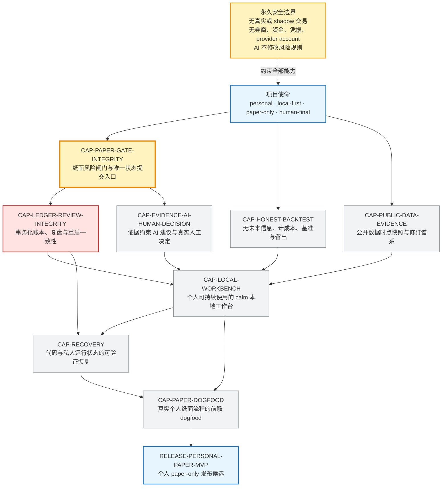

# 投研纪律系统｜固定蓝图与当前指针

> 这是给 Javen 查看进度的只读窗口，不决定路线、不授权执行、不构成验收。

## 这个页面以后怎么变

- **固定蓝图不随日常工作重画。** 下方产品能力节点和依赖来自 `IDS-PERSONAL-PAPER-PRODUCT-CAPABILITIES-V1`。
- **固定交付链不增删步骤。** 今后只移动当前高亮、更新证据和时间。
- 只有项目目标或能力依赖真的改变，并形成新的权威 Graph 版本时，蓝图结构才会改变；届时必须单独说明“为什么改版”。
- 调试反例、失败根因和历史回溯不再长进主图，只写在本页后面的当前证据或项目 evidence 中。

## 固定产品蓝图

**固定结构中的当前位置：** `CAP-PAPER-GATE-INTEGRITY`。它没有验收，所以依赖它的 Ledger 仍是 `BLOCKED`。

## 固定交付链与当前阶段

```mermaid
flowchart LR
    E0["E0<br/>方向已选"] --> E1["E1<br/>Mutable 候选"]
    E1 --> E2["E2<br/>预冻结独立审查"]
    E2 --> E3["E3<br/>冻结 exact C"]
    E3 --> E4["E4<br/>Fresh exact review"]
    E4 --> E5["E5<br/>单收据 activation A"]
    E5 --> E6["E6<br/>本机 authority registration"]
    E6 --> E7["E7<br/>check-work → start-work"]
    E7 --> E8["E8<br/>实现与节点验收"]
    E8 --> E9["E9<br/>移动到下一能力"]

    classDef done fill:#d3f9d8,stroke:#2b8a3e,stroke-width:2px;
    classDef current fill:#e7f5ff,stroke:#1971c2,stroke-width:3px;
    classDef pending fill:#f1f3f5,stroke:#868e96;
    class E0,E1,E2,E3,E4,E5,E6,E7 done;
    class E8 current;
    class E9 pending;
```

**当前指针：`E8｜实现与节点验收（产品 exact review 失败；terminal-stall 候选复审中）`。**

E4–E7 已依次完成：冻结候选通过独立 exact-object review，单收据 activation A 已形成，本机 authority 已注册，一次性 attempt 已原子启动。现在只授权当前 Paper Gate 整数权威切片；Paper Gate 完成并验收后，固定产品蓝图中的指针才会移动到 Ledger。

E8 的产品候选已经冻结并接受 fresh exact review，但结论是 `FAIL`。因此 E8 没有完成，指针也没有移动到 E9；当前只在执行 Graph 预先规定的 stall/backtrack 分支。

## 当前事实

- 更新时间：`2026-07-31T08:34:20-0700`
- 当前 Graph 节点：`CAP-PAPER-GATE-INTEGRITY`
- 当前候选工作：`WORK-PAPER-GATE-INTEGER-AUTHORITY-R1`
- 当前义务：`OBL-PAPER-UNIQUE-COMMIT-SINK`
- accepted Graph 阶段：`activated_review_successor`
- 产品候选阶段：`frozen_exact_review_failed`
- terminal-stall Graph 候选阶段：`frozen_candidate_fresh_exact_review_running`
- 冻结 candidate C：`aebbbbc15c065cc957ed41a581de1fc8d3324519`
- activation successor A：`4517d099f743bdb20b3e73c046f0296202a788fd`
- 冻结产品候选 P：`e1ec606ec245cc136ea32f98b61ab1bb6a3702dd`
- 产品候选 tree：`00b269ce2e0ae0597e3eacd43cdccb071e814453`
- 冻结 terminal-stall 候选 S：`02a2512c7423bad2f90358737aaae052a1bedd46`
- terminal-stall 候选 tree：`74b399b8be66359b875abfd904348bb327a87624`
- terminal-stall 候选写集：要求 `11 paths`；实际 `11 paths`
- 当前状态：唯一产品 attempt 已冻结并在 fresh exact review 失败；不再拥有继续编辑产品的权限
- 当前运行路线：accepted Graph 尚显示 `Paper Gate = ACTIVE`、`Ledger = BLOCKED`；冻结 stall candidate 提议 `Paper Gate = STALLED`，但 fresh exact review 和单收据 activation 完成前不能称为已接受
- 生产 registration：已建立；父目录模式 `drwx------`，文件模式 `-rw-------`
- 生产 attempt ref `refs/ids-attempts/paper-gate-integer-authority-r1`：指向 activation A
- Ledger 产品写集：`NONE_AUTHORIZED`
- Paper Gate 产品写集：冻结为既定 `8 paths`；terminal-stall 候选不修改任何 prototype 文件
- E2 最终结论：`GO_FREEZE_C — Critical 0 / Major 0 / Minor 0`
- E4 最终结论：`PASS — Critical 0 / Major 0 / Minor 0`
- terminal-stall 预冻结审查：`GO_FREEZE_STALL_C — Critical 0 / Major 0 / Minor 0`
- 当前动作：在独立完整 clone 中审查 immutable S；不做产品字段补丁、不创建 R5、不解锁 Ledger
- 当前工作：`WORK-PAPER-GATE-INTEGER-AUTHORITY-R1`

## 当前候选正在重新证明什么

- 项目级 `AGENTS.md` 已要求：只有冻结且通过独立审查的 Graph 候选，才可能进入后续启动链；Graph 只能版本化修订，不能按进展原地改写。
- S 只记录已发生的失败分支：Paper Gate `active → stalled`、Product Build `active → stalled`；Graph 拓扑、目标、current work、义务、V3 和 prototype 均不改变。
- P 的 FAIL 收据按 raw bytes、canonical semantics、commit、tree、唯一父提交、子树与 `8 paths` 写集绑定。
- S 的候选写集固定为 `11 paths`；其 future activation 只能新增一份 fresh-review receipt。
- 即使 future stall activation 被接受，`register-authority`、`check-work`、`start-work` 和产品 execution 仍全部硬拒绝。
- 安全边界保持 `personal/local-first/paper-only/human-final`。

## 当前验证证据

- terminal-stall Product + Mission，`PYTHONINTMAXSTRDIGITS=640`：`77 tests in 39.881s`，`OK (skipped=1)`
- terminal-stall Product + Mission，`PYTHONINTMAXSTRDIGITS=0`：`77 tests in 37.526s`，`OK (skipped=1)`
- 冻结 P 的 prototype 回归，`PYTHONINTMAXSTRDIGITS=640`：`114 tests in 14.894s`，`OK`
- 冻结 P 的 prototype 回归，`PYTHONINTMAXSTRDIGITS=0`：`114 tests in 8.780s`，`OK`
- terminal-stall Ruff：`All checks passed!`；`4 files already formatted`
- terminal-stall `git diff --check`：PASS
- 冻结前审查最终结论：`GO_FREEZE_PRODUCT_C — Critical 0 / Major 0 / Minor 0`
- 冻结前审查已发现并关闭三类真实缺陷：post-admission 故障错误分类；损坏 typed command 未封闭为 `MALFORMED`；普通 pre-COMMIT/reconcile 故障未返回 closed outcome
- Fresh exact-object review：`FAIL — Critical 1 / Major 0 / Minor 0`
- Fresh exact FAIL receipt：SHA-256 `304fbbadaa6f1e3bd133013cae9307ea4187d9729bb8f9d3e50c646b0381dfc1`
- 未满足义务：`OBL-PAPER-UNIQUE-COMMIT-SINK`；有限深层 JSON bytes 会泄漏非 typed `RecursionError`
- Graph 规定的结果：`STALL_AND_BACKTRACK_TO_FRESH_DIRECTION_REVIEW`；`automatic_successor=false`、`R5=false`、`field_patch=false`
- terminal-stall prefreeze review：`GO_FREEZE_STALL_C — Critical 0 / Major 0 / Minor 0`
- Product 与 Mission 的冻结态 `check-candidate`：PASS；`candidate_phase=frozen_candidate`；`execution_authorized=false`
- S 的唯一父提交：P；prototype subtree：`bde10889591debce701ff4f7a91fb27ae023e902`
- S 的 fresh exact-object review：运行中；尚无 PASS receipt、尚无 activation
- tracked `prototype/**` diff：空；冻结 V3 diff：空

## E8 当前怎么走

1. 产品候选 P 的 fresh exact review 已失败，保留 P 与 FAIL 收据。
2. 最小 terminal-stall candidate S 已冻结；不修改产品。
3. 当前在独立完整 clone 中做 S 的 fresh exact-object review。
4. 只有 S 通过，才形成只增加该 PASS receipt 的单文件 activation；它仍不授权产品执行。
5. Stall 被接受后，从该 accepted base 形成新的方向提案与独立方向审查；方向通过前不构造新产品尝试，Ledger 继续 blocked。

## 权威入口

- 项目工作规则：`AGENTS.md`
- 全项目路线：`governance/PROJECT_MISSION_GRAPH_V2.json`
- 固定产品能力依赖：`governance/PRODUCT_CAPABILITY_GRAPH_V1.json`
- 冻结失败 attempt 边界：`governance/PAPER_GATE_STATE_MACHINE_BOUNDARY_V3.json`
- terminal-stall candidate contract：`governance/PAPER_GATE_INTEGER_AUTHORITY_STALL_TRANSITION_R1.json`
- 产品 FAIL 收据：`governance/evidence/PAPER_GATE_INTEGER_AUTHORITY_PRODUCT_R1.fresh-exact-review.json`

以后本页只更新：**当前指针、节点状态、证据、时间**。蓝图结构变化必须作为单独的版本决策说明。
