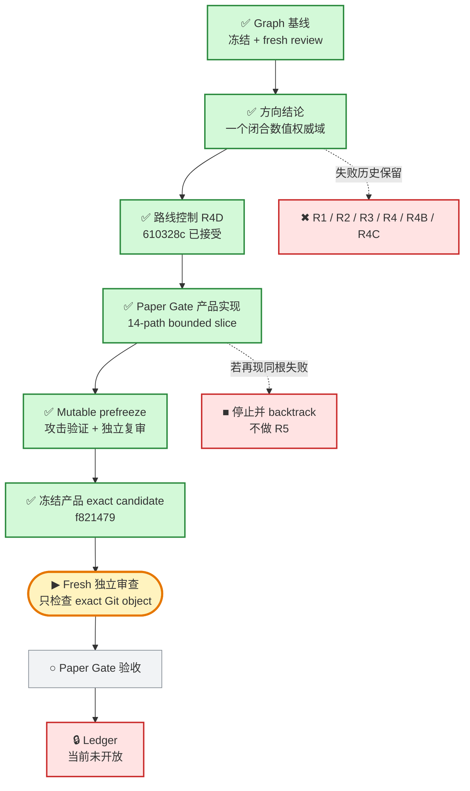

# 投研纪律系统｜当前 Graph

> 这是给 Javen 查看进度的只读窗口。它不决定路线，也不构成验收；权威路线仍由冻结的 Mission Graph 和 Product Capability Graph 控制。

## 现在在哪

一句话：闭合数值域产品切片已经实现并通过 mutable prefreeze；exact candidate `f821479` 已冻结，当前 fresh reviewer 只检查该不可变 Git 对象。Ledger 仍锁定。

## 项目目标与产品主路径

## 当前状态

- 更新时间：`2026-07-30T17:44:06-0700`
- 执行状态：`RUNNING_PRODUCT_R4_FROZEN_REVIEW`
- Graph 当前节点：`CAP-PAPER-GATE-INTEGRITY`
- 当前工作项：`WORK-PAPER-GATE-SINGLE-STATE-MACHINE-R1`
- 当前义务：`OBL-PAPER-UNIQUE-COMMIT-SINK`
- 当前实现：`唯一 closed-domain Paper Gate successor；已冻结，fresh review 中`
- R1 失败快照：`294e92b2d53c024dd99d1f787dd6e82f0926081d`
- R2 失败快照：`1afc87d2df802efd1563ce9c43c1b0cb7efcf7c4`
- R3 失败快照：`b2745910770c016327f73e749771e63626983d58`
- R3 失败收据：`/private/tmp/PAPER_GATE_R3_B274591.prefreeze-failure.json`
- R4 路线绑定失败快照：`ab021e94d94357e9a82255dbf62f3f53c60d50c0`
- R4 路线绑定失败收据：`/private/tmp/PAPER_GATE_DIRECTION_R4_AB021E9.prefreeze-failure.json`
- R4B 路线绑定失败快照：`c1a19d2f33b3a2c40b2938b5c381b10f2cd1803c`
- R4B 路线绑定失败收据：`/private/tmp/PAPER_GATE_DIRECTION_R4B_C1A19D2.prefreeze-failure.json`
- R4C 路线绑定失败快照：`40c88981942bea40502010521623d8d9fef61e58`
- R4C frozen-review 失败收据：`/private/tmp/PAPER_GATE_DIRECTION_R4C_40C8898.frozen-review-failure.json`
- 当前根因：并非某一个 Decimal 字段，而是没有在 canonical event、reducer 和 replay 之前，把所有权威数值原语收敛到同一个封闭、有界、环境无关的表示域。
- 方向结论：`一个覆盖所有权威 numeric primitive 的 closed canonical scalar/value domain；不是 R3 字段补丁`
- 已接受的路线控制：`610328ce328834bd43c60e1cc0fa2aaa7d5866c7`
- Route-control fresh review 收据：`/private/tmp/PAPER_GATE_DIRECTION_R4D_610328C.fresh-review-pass.json`
- Mutable prefreeze：`PASS`（完整 prototype 在 `sys.int_max_str_digits=640` 与 `0` 下均为 `95 passed in 2.20s`；独立源码复审 `PASS_PREFREEZE`）
- 当前动作：fresh reviewer 直接检查 commit `f821479111c8925220219dffd45b47e60086cb22`、tree `8e61b9c0750c66bb0da8c930e2fe261d0ab456f5`、parent、subtree、14-path diff、源码与反例；不信任 mutable worktree 或 prefreeze 声称。
- 当前产品写集：`14 paths`（既有 inventory；不新增 Graph、governance、authority kernel 或 parallel numeric protocol）
- 当前产品候选：`f821479111c8925220219dffd45b47e60086cb22`（frozen；pending fresh review）
- 产品候选收据：`/private/tmp/PAPER_GATE_R4_F821479.candidate.json`（`5339 bytes`；SHA-256 `db383182fa8c379409966399c285a2ec9708898ff5ca1203dd6b89833a5eec67`）
- Ledger：`未开放`
- 用户参与：`当前不需要`

## 权威来源

- 全项目路线：`governance/PROJECT_MISSION_GRAPH_V2.json`
- 产品能力依赖：`governance/PRODUCT_CAPABILITY_GRAPH_V1.json`
- 当前节点边界：`governance/PAPER_GATE_STATE_MACHINE_BOUNDARY_V2.json`
- 当前冻结 Graph 基线：`23ffe3dc67d17fde1e42fc53ac845945849f4dd2`

本页只在阶段切换、候选冻结、fresh review 完成、真实阻塞或项目完成时更新；普通测试与局部思考不写入。
