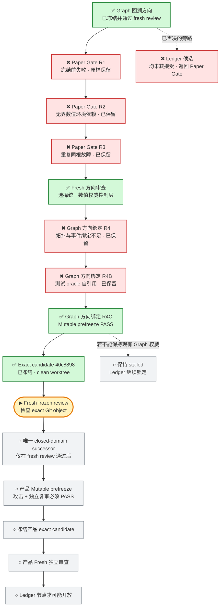

# 投研纪律系统｜当前 Graph

> 这是给 Javen 查看进度的只读窗口。它不决定路线，也不构成验收；权威路线仍由冻结的 Mission Graph 和 Product Capability Graph 控制。

## 现在在哪

一句话：项目没有停；Graph 仍把工作锁在 **Paper Gate**。R4C 已从冻结 Git 基线独立得出 Graph 合同答案，并通过 coordinated-rewrite 攻击与 mutable prefreeze 复审；exact candidate `40c8898` 已冻结。当前 fresh reviewer 只检查这个不可变 Git 对象，通过前不写新的 prototype，Ledger 没有开放。

## 项目目标与产品主路径

## 当前状态

- 更新时间：`2026-07-30T06:33:30-0700`
- 执行状态：`RUNNING_ROUTE_CONTROL_R4C_FROZEN_REVIEW`
- Graph 当前节点：`CAP-PAPER-GATE-INTEGRITY`
- 当前实现：`R4C exact route-control candidate 已冻结；fresh review 尚未接受`
- R1 失败快照：`294e92b2d53c024dd99d1f787dd6e82f0926081d`
- R2 失败快照：`1afc87d2df802efd1563ce9c43c1b0cb7efcf7c4`
- R3 失败快照：`b2745910770c016327f73e749771e63626983d58`
- R3 失败收据：`/private/tmp/PAPER_GATE_R3_B274591.prefreeze-failure.json`
- R4 路线绑定失败快照：`ab021e94d94357e9a82255dbf62f3f53c60d50c0`
- R4 路线绑定失败收据：`/private/tmp/PAPER_GATE_DIRECTION_R4_AB021E9.prefreeze-failure.json`
- R4B 路线绑定失败快照：`c1a19d2f33b3a2c40b2938b5c381b10f2cd1803c`
- R4B 路线绑定失败收据：`/private/tmp/PAPER_GATE_DIRECTION_R4B_C1A19D2.prefreeze-failure.json`
- 当前根因：并非某一个 Decimal 字段，而是没有在 canonical event、reducer 和 replay 之前，把所有权威数值原语收敛到同一个封闭、有界、环境无关的表示域。
- 方向结论：`一个覆盖所有权威 numeric primitive 的 closed canonical scalar/value domain；不是 R3 字段补丁`
- 当前动作：fresh reviewer 直接检查 commit `40c88981942bea40502010521623d8d9fef61e58` 的 tree、parent、subtree、两文件写集、冻结基线 oracle 与 coordinated-rewrite 反例；不信任 mutable worktree 或 prefreeze 声称。
- 当前候选：`40c88981942bea40502010521623d8d9fef61e58`（route-control only；pending fresh review）
- Ledger：`未开放`
- 用户参与：`当前不需要`

## 权威来源

- 全项目路线：`governance/PROJECT_MISSION_GRAPH_V2.json`
- 产品能力依赖：`governance/PRODUCT_CAPABILITY_GRAPH_V1.json`
- 当前节点边界：`governance/PAPER_GATE_STATE_MACHINE_BOUNDARY_V1.json`
- 当前冻结 Graph 基线：`23ffe3dc67d17fde1e42fc53ac845945849f4dd2`

本页只在阶段切换、候选冻结、fresh review 完成、真实阻塞或项目完成时更新；普通测试与局部思考不写入。
