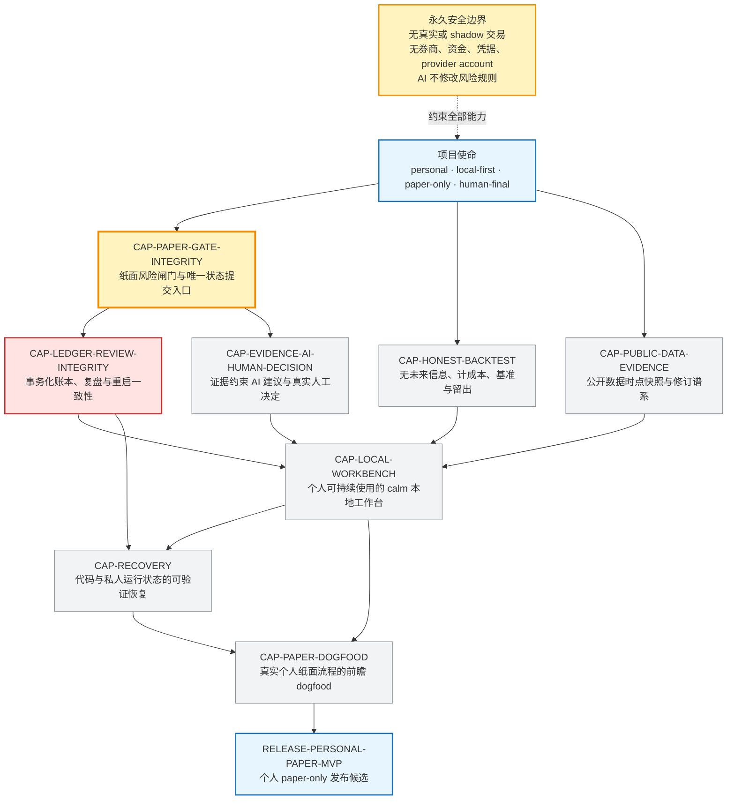
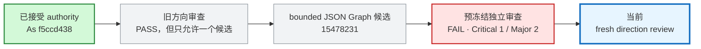

# 投研纪律系统｜固定蓝图与当前指针

> 这是给 Javen 查看进度的只读窗口，不决定路线、不授权执行、不构成验收。

## 这个页面以后怎么变

- **固定蓝图不随日常工作重画。** 下方产品能力节点和依赖来自 `IDS-PERSONAL-PAPER-PRODUCT-CAPABILITIES-V1`。
- **固定交付链不增删步骤。** 今后只移动当前高亮、更新证据和时间。
- 只有项目目标或能力依赖真的改变，形成单独候选、冻结 exact bytes 并通过独立审查后，蓝图结构才可能产生新版本；候选在被接受前对本页蓝图没有任何影响。
- 调试反例、失败根因和历史回溯不再长进主图，只写在本页后面的当前证据或项目 evidence 中。

| 层 | 现在是什么 | 允许怎么变 |
|---|---|---|
| 冻结蓝图 | Mission Graph + Product Capability Graph | 不能按进度原地改写；只能被“冻结且独立审查通过”的新版本替代 |
| 当前指针 | Paper Gate；bounded JSON 候选已在预冻结审查失败，已回到 fresh direction review | 只随已发生且有证据的状态移动 |
| 隔离候选 | `154782315b2e50ebedd74d4e78f7a2e3cd985d71`，失败历史 | 已提交为不可变失败证据；不能修成 PASS、不能激活、不能启动产品工作 |

## 固定产品蓝图

**固定结构中的当前位置：** `CAP-PAPER-GATE-INTEGRITY`。它没有验收，所以依赖它的 Ledger 仍是 `BLOCKED`。

## 固定交付链与当前阶段

```mermaid
flowchart LR
    E0["E0<br/>方向选择门"] --> E1["E1<br/>Mutable 候选"]
    E1 --> E2["E2<br/>预冻结独立审查"]
    E2 --> E3["E3<br/>冻结 exact C"]
    E3 --> E4["E4<br/>Fresh exact review"]
    E4 --> E5["E5<br/>单收据 activation A"]
    E5 --> E6["E6<br/>本机 authority registration"]
    E6 --> E7["E7<br/>check-work → start-work"]
    E7 --> E8["E8<br/>实现与节点验收"]
    E8 --> E9["E9<br/>移动到下一能力"]

    classDef done fill:#d3f9d8,stroke:#2b8a3e,stroke-width:2px;
    classDef current fill:#e7f5ff,stroke:#1971c2,stroke-width:3px;
    classDef failed fill:#ffe3e3,stroke:#c92a2a,stroke-width:2px;
    classDef pending fill:#f1f3f5,stroke:#868e96;
    class E0 current;
    class E1,E2 failed;
    class E3,E4,E5,E6,E7,E8,E9 pending;
```

**当前指针：退回 `E0｜fresh direction review`。bounded JSON 候选到达 `E2` 后被独立审查拒绝；它没有进入 E3，也没有获得任何执行权。**

每一次失败候选都保留，但证据不能转移给下一候选。若 fresh direction review 选出新方向，新的 E1–E8 必须重新逐步完成；方向审查通过本身也不等于 Graph 已修改或产品已获授权。

固定产品蓝图中的能力指针仍停在 Paper Gate；只有 Paper Gate 通过产品验收后，才会移动到 Ledger。

## 这一次指针为什么退回

## 当前最短状态

| 问题 | 现在的答案 |
|---|---|
| 固定目标变了吗？ | 没有。仍是 personal / local-first / paper-only / human-final |
| 固定能力蓝图变了吗？ | 没有。当前能力仍是 Paper Gate，Ledger 仍 blocked |
| accepted Graph 变了吗？ | 没有。仍停在 terminal-stall activation `f5ccd438bfed54fbe618d225431c61f65800b475` |
| 产品有编辑权吗？ | 没有。Graph activation、registration、check-work、start-work 均未发生 |
| 哪个东西失败了？ | 未获权的 bounded JSON Graph candidate `154782315b2e50ebedd74d4e78f7a2e3cd985d71` |
| 为什么失败？ | 同一有限上限无法覆盖 envelope → approval 的增大；reference trace 不能按声明配方复现；V3 产品范围继承有缺口 |
| 现在做什么？ | 保留失败候选和收据，从 accepted stall 基线做 fresh direction review |

## 历史明细（只作追溯，不决定当前路线）

- 更新时间：`2026-07-31T11:27:50-0700`
- 当前 Graph 节点：`CAP-PAPER-GATE-INTEGRITY`
- 历史失败工作：`WORK-PAPER-GATE-INTEGER-AUTHORITY-R1`
- 当前义务：`OBL-PAPER-UNIQUE-COMMIT-SINK`
- accepted Graph 阶段：`activated_review_successor`
- 产品候选阶段：`frozen_exact_review_failed`
- terminal-stall Graph 阶段：`accepted_single_receipt_activation`
- 上一 fresh direction 阶段：`PASS — Critical 0 / Major 0 / Minor 0`，但只允许一个候选，现已耗尽且不可复用
- bounded JSON Graph candidate 阶段：`FAILED_PREFREEZE_NOT_ACCEPTED`
- bounded JSON Graph candidate commit：`154782315b2e50ebedd74d4e78f7a2e3cd985d71`
- bounded JSON Graph candidate tree：`24c0b86f864582506a4e5dd7b6d0656edf94893c`
- bounded JSON Graph prefreeze review：`FAIL — Critical 1 / Major 2 / Minor 0`
- bounded JSON failure receipt commit：`2d46b54eb9214d5e07bb2a9d57326ea724312924`
- bounded JSON failure receipt bytes：`8644`
- bounded JSON failure receipt SHA-256：`6e46d473d4f52efb160f8697c15d48d8c1fc064fe80e150a40f0ce47539d5fa9`
- 冻结 candidate C：`aebbbbc15c065cc957ed41a581de1fc8d3324519`
- activation successor A：`4517d099f743bdb20b3e73c046f0296202a788fd`
- 冻结产品候选 P：`e1ec606ec245cc136ea32f98b61ab1bb6a3702dd`
- 产品候选 tree：`00b269ce2e0ae0597e3eacd43cdccb071e814453`
- 冻结 terminal-stall 候选 S：`02a2512c7423bad2f90358737aaae052a1bedd46`
- terminal-stall 候选 tree：`74b399b8be66359b875abfd904348bb327a87624`
- S fresh exact review：`FAIL — Critical 0 / Major 1 / Minor 0`
- 冻结 terminal-stall 候选 S2：`59cd60e6c3e549f0e30fa02ea7a28b10e0bdf578`
- S2 tree：`cb1b91592cda0c3497e26d98760ce0878c2d8954`
- terminal-stall 候选写集：要求 `11 paths`；实际 `11 paths`
- S2 fresh exact review：`PASS — Critical 0 / Major 0 / Minor 0`
- terminal-stall activation As：`f5ccd438bfed54fbe618d225431c61f65800b475`
- As tree：`3c8874a77ca601c2611103d3b6aab8ce45782ef4`
- 新方向提案：`DIR-PAPER-GATE-BOUNDED-JSON-INGRESS-R1`
- 上一方向提案阶段：`HISTORICAL_PASS_EXHAUSTED_BY_FAILED_CANDIDATE`
- 新方向提案 bytes：`19734`
- 新方向提案 SHA-256：`8d1fe8144b0e23b30e69306fad62952fad99fa4cc1a5eb571071be51a675273f`
- 新方向审查：`DIR-REVIEW-PAPER-GATE-BOUNDED-JSON-INGRESS-R1`
- 新方向审查 receipt bytes：`16680`
- 新方向审查 receipt SHA-256：`5984e94abb3e757aeeadf56c62420f4862268cfca0336b2ed255954a1a1c1d30`
- 新 Graph candidate 允许写集：精确 `12 paths`；prototype 必须不变
- 当前状态：bounded JSON Graph candidate 在预冻结审查失败；没有产品编辑权，正在回到 fresh direction review
- 当前运行路线：accepted Graph 显示 `Paper Gate = STALLED`、`Ledger = BLOCKED`、eligible work 为空、execution 未授权
- 历史 registration：原样保留但只绑定旧 attempt，不能转移或复用
- 历史 attempt ref `refs/ids-attempts/paper-gate-integer-authority-r1`：原样保留并继续只指向旧 activation A
- Ledger 产品写集：`NONE_AUTHORIZED`
- Paper Gate 当前产品写集：`NONE_AUTHORIZED`
- bounded JSON E2 最终结论：`FAIL — Critical 1 / Major 2 / Minor 0`
- E4 最终结论：`PASS — Critical 0 / Major 0 / Minor 0`
- S2 预冻结审查：`GO_FREEZE_STALL_C_R2 — Critical 0 / Major 0 / Minor 0`
- 当前动作：从 accepted stall activation 做 fresh direction review；不得原地修补失败候选
- 当前工作：`NONE_AUTHORIZED_DURING_FRESH_DIRECTION_REVIEW`

## 这次失败证明了什么

- 项目级 `AGENTS.md` 已要求：只有冻结且通过独立审查的 Graph 候选，才可能进入后续启动链；Graph 只能版本化修订，不能按进展原地改写。
- 旧方向正确识别了 decoder 的资源边界问题，但错误要求所有输入和派生工件共用同一有限 profile；一个合法 envelope 可能生成更大的 approval，因此该方向不能闭合现有工作流。
- V4 的 trace 尺寸指标能够复现，但生成时把第一次 `create_account` 放在固定时钟 patch 之外；后续事件 hash 链和两个 receipt 因此不能按文档配方复现。
- V4 还把 V3 的真实产品范围误标为“旧授权历史”，会无意缩小既有验收；独立审查因此拒绝候选。
- 失败候选和失败收据已经保存；旧 direction PASS 只允许过这一个候选，不能成为下一候选的授权。
- 下一步必须比较新的根因级方向并做 fresh 独立方向审查；不能只换 7 个 hash、抬高同一个上限或加 R2 字段。
- 安全边界保持 `personal/local-first/paper-only/human-final`。

## 当前验证证据

- S2 Product + Mission，`PYTHONINTMAXSTRDIGITS=640`：`77 tests in 33.733s`，`OK (skipped=1)`
- S2 Product + Mission，`PYTHONINTMAXSTRDIGITS=0`：`77 tests in 34.327s`，`OK (skipped=1)`
- 冻结 P 的 prototype 回归，`PYTHONINTMAXSTRDIGITS=640`：`114 tests in 3.334s`，`OK`
- 冻结 P 的 prototype 回归，`PYTHONINTMAXSTRDIGITS=0`：`114 tests in 4.521s`，`OK`
- terminal-stall Ruff：`All checks passed!`；`4 files already formatted`
- terminal-stall `git diff --check`：PASS
- 冻结前审查最终结论：`GO_FREEZE_PRODUCT_C — Critical 0 / Major 0 / Minor 0`
- 冻结前审查已发现并关闭三类真实缺陷：post-admission 故障错误分类；损坏 typed command 未封闭为 `MALFORMED`；普通 pre-COMMIT/reconcile 故障未返回 closed outcome
- Fresh exact-object review：`FAIL — Critical 1 / Major 0 / Minor 0`
- Fresh exact FAIL receipt：SHA-256 `304fbbadaa6f1e3bd133013cae9307ea4187d9729bb8f9d3e50c646b0381dfc1`
- 未满足义务：`OBL-PAPER-UNIQUE-COMMIT-SINK`；有限深层 JSON bytes 会泄漏非 typed `RecursionError`
- Graph 规定的结果：`STALL_AND_BACKTRACK_TO_FRESH_DIRECTION_REVIEW`；`automatic_successor=false`、`R5=false`、`field_patch=false`
- terminal-stall prefreeze review：`GO_FREEZE_STALL_C — Critical 0 / Major 0 / Minor 0`
- S fresh exact-object review：`FAIL — Critical 0 / Major 1 / Minor 0`
- S FAIL receipt：`11492` bytes；SHA-256 `fbbaa496b319ca59567cd2f71cf537e9f85f128d6d8ed0d3ace34eeef19e262c`
- S→S2：10 个 candidate blob 相同；唯一差异是负例不再绑定 mutable-only 错误文案，仍要求拒绝
- S2 prefreeze review：`GO_FREEZE_STALL_C_R2 — Critical 0 / Major 0 / Minor 0`
- Product 与 Mission 的 S2 冻结态 `check-candidate`：PASS；`candidate_phase=frozen_candidate`；`execution_authorized=false`
- S2 的唯一父提交：P；prototype subtree：`bde10889591debce701ff4f7a91fb27ae023e902`
- S2 fresh exact-object review：`PASS — Critical 0 / Major 0 / Minor 0`
- S2 review receipt：`4635` bytes；SHA-256 `ecb506ac4dda141b304ae54b8d87d5d41691660c767c9081154575f6cc4ad269`
- terminal-stall 单收据 activation：`f5ccd438bfed54fbe618d225431c61f65800b475`
- activation 后 Product 与 Mission 的 `check`、`check-view`、`check-candidate`：PASS 且 `execution_authorized=false`
- activation 后 Product 与 Mission 的 `register-authority`、`check-work`、`start-work`：全部 fail closed；registration、designation ref、attempt ref 均未改变
- fresh direction proposal：JSON 有效；base identity 和 clean worktree 已复核
- fresh direction review：`PASS — Critical 0 / Major 0 / Minor 0`
- direction review receipt：`16680` bytes；SHA-256 `5984e94abb3e757aeeadf56c62420f4862268cfca0336b2ed255954a1a1c1d30`
- direction review 的唯一候选已构造并在 prefreeze 被拒绝；该 PASS 已耗尽，不能授权第二个候选
- 失败候选：`154782315b2e50ebedd74d4e78f7a2e3cd985d71`；tree `24c0b86f864582506a4e5dd7b6d0656edf94893c`；prototype subtree 仍为 `bde10889591debce701ff4f7a91fb27ae023e902`
- bounded JSON prefreeze review：`FAIL — Critical 1 / Major 2 / Minor 0`
- failure receipt：`8644` bytes；SHA-256 `6e46d473d4f52efb160f8697c15d48d8c1fc064fe80e150a40f0ce47539d5fa9`
- failure receipt commit：`2d46b54eb9214d5e07bb2a9d57326ea724312924`
- tracked `prototype/**` diff：空；冻结 V3 diff：空

## 当前回退链怎么走

1. 产品候选 P 的 fresh exact review 已失败，保留 P 与 FAIL 收据。
2. 最小 terminal-stall candidate S 已冻结但 fresh exact review 失败；S 与 FAIL 收据均保留。
3. S2 从同一父基线重新冻结；相对 S 只关闭该 review finding，并已通过独立 exact review。
4. 只增加 S2 PASS receipt 的 activation As 已形成；它接受 stall，但不授权产品执行。
5. 从 As 形成的 bounded JSON 方向提案通过独立方向审查；该 PASS 只允许一个新候选，不改 accepted Graph，也不授权产品。
6. 该 `12-path` Graph candidate 已保存为 `154782315b2e50ebedd74d4e78f7a2e3cd985d71`，并在 prefreeze review 以 `Critical 1 / Major 2 / Minor 0` 失败。
7. 单文件失败收据保存在 commit `2d46b54eb9214d5e07bb2a9d57326ea724312924`；当前从 As 回到 fresh direction review，不能从失败候选继续。

## 权威入口

- 项目工作规则：`AGENTS.md`
- 全项目路线：`governance/PROJECT_MISSION_GRAPH_V2.json`
- 固定产品能力依赖：`governance/PRODUCT_CAPABILITY_GRAPH_V1.json`
- 冻结失败 attempt 边界：`governance/PAPER_GATE_STATE_MACHINE_BOUNDARY_V3.json`
- terminal-stall candidate contract：`governance/PAPER_GATE_INTEGER_AUTHORITY_STALL_TRANSITION_R1.json`
- 产品 FAIL 收据：`governance/evidence/PAPER_GATE_INTEGER_AUTHORITY_PRODUCT_R1.fresh-exact-review.json`
- terminal-stall PASS 收据：`governance/evidence/PAPER_GATE_INTEGER_AUTHORITY_STALL_TRANSITION_R1.fresh-review-pass.json`
- S fresh review FAIL 收据：`PAPER_GATE_INTEGER_AUTHORITY_STALL_TRANSITION_R1.fresh-review-fail.json`
- 历史 bounded JSON 方向提案：`governance/evidence/PAPER_GATE_BOUNDED_JSON_INGRESS_DIRECTION_R1.proposal.json`，只存在于失败候选历史
- 历史方向 PASS 收据：`governance/evidence/PAPER_GATE_BOUNDED_JSON_INGRESS_DIRECTION_R1.fresh-review-pass.json`，不可复用
- bounded JSON Graph prefreeze FAIL 收据：`governance/evidence/PAPER_GATE_BOUNDED_JSON_INGRESS_GRAPH_R1.prefreeze-failure.json`

以后本页只更新：**当前指针、节点状态、证据、时间**。蓝图结构变化必须作为单独的版本决策说明。
