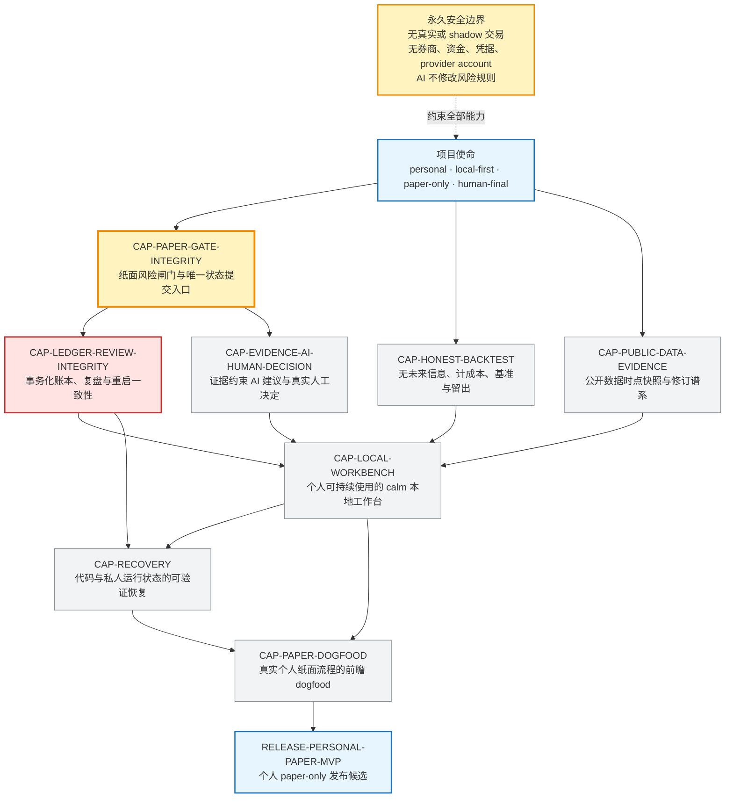

# 投研纪律系统｜固定蓝图与当前指针

> 这是给 Javen 查看进度的只读窗口，不决定路线、不授权执行、不构成验收。

## 这个页面以后怎么变

- **固定蓝图不随日常工作重画。** 下方产品能力节点和依赖来自 `IDS-PERSONAL-PAPER-PRODUCT-CAPABILITIES-V1`。
- **固定交付链不增删步骤。** 今后只移动当前高亮、更新证据和时间。
- 只有项目目标或能力依赖真的改变，并形成新的权威 Graph 版本时，蓝图结构才会改变；届时必须单独说明“为什么改版”。
- 调试反例、失败根因和历史回溯不再长进主图，只写在本页后面的当前证据或项目 evidence 中。

## 固定产品蓝图

**固定结构中的当前位置：** `CAP-PAPER-GATE-INTEGRITY`。它没有验收，所以依赖它的 Ledger 仍是 `BLOCKED`。

## 固定交付链与当前阶段

```mermaid
flowchart LR
    E0["E0<br/>方向已选"] --> E1["E1<br/>Mutable 候选"]
    E1 --> E2["E2<br/>预冻结独立审查"]
    E2 --> E3["E3<br/>冻结 exact C"]
    E3 --> E4["E4<br/>Fresh exact review"]
    E4 --> E5["E5<br/>单收据 activation A"]
    E5 --> E6["E6<br/>本机 authority registration"]
    E6 --> E7["E7<br/>check-work → start-work"]
    E7 --> E8["E8<br/>实现与节点验收"]
    E8 --> E9["E9<br/>移动到下一能力"]

    classDef done fill:#d3f9d8,stroke:#2b8a3e,stroke-width:2px;
    classDef current fill:#e7f5ff,stroke:#1971c2,stroke-width:3px;
    classDef pending fill:#f1f3f5,stroke:#868e96;
    class E0,E1,E2,E3,E4,E5,E6,E7 done;
    class E8 current;
    class E9 pending;
```

**当前指针：`E8｜实现与节点验收`。**

E4–E7 已依次完成：冻结候选通过独立 exact-object review，单收据 activation A 已形成，本机 authority 已注册，一次性 attempt 已原子启动。现在只授权当前 Paper Gate 整数权威切片；Paper Gate 完成并验收后，固定产品蓝图中的指针才会移动到 Ledger。

## 当前事实

- 更新时间：`2026-07-31T06:45:45-0700`
- 当前 Graph 节点：`CAP-PAPER-GATE-INTEGRITY`
- 当前候选工作：`WORK-PAPER-GATE-INTEGER-AUTHORITY-R1`
- 当前义务：`OBL-PAPER-UNIQUE-COMMIT-SINK`
- Graph 阶段：`activated_review_successor`
- 产品候选阶段：`frozen_exact_object_review`
- 冻结 candidate C：`aebbbbc15c065cc957ed41a581de1fc8d3324519`
- activation successor A：`4517d099f743bdb20b3e73c046f0296202a788fd`
- 冻结产品候选 P：`e1ec606ec245cc136ea32f98b61ab1bb6a3702dd`
- 产品候选 tree：`00b269ce2e0ae0597e3eacd43cdccb071e814453`
- 候选写集：要求 `12 paths`；实际 `12 paths`
- 当前状态：Graph exact review 已通过；当前 attempt 的 `execution_authorized=true`
- 当前运行路线：`Paper Gate = ACTIVE ONE ATTEMPT`；`Ledger = BLOCKED`
- 生产 registration：已建立；父目录模式 `drwx------`，文件模式 `-rw-------`
- 生产 attempt ref `refs/ids-attempts/paper-gate-integer-authority-r1`：指向 activation A
- Ledger 产品写集：`NONE_AUTHORIZED`
- Paper Gate 产品写集：仅既定 `8 paths`，当前无额外 tracked、untracked 或 ignored 文件
- E2 最终结论：`GO_FREEZE_C — Critical 0 / Major 0 / Minor 0`
- E4 最终结论：`PASS — Critical 0 / Major 0 / Minor 0`
- 当前动作：产品候选 P 已以 activation A 为唯一父提交冻结；fresh reviewer 正在完整 `--no-local` clone 中检查 exact object，尚未验收
- 当前工作：`WORK-PAPER-GATE-INTEGER-AUTHORITY-R1`

## 当前候选正在重新证明什么

- 项目级 `AGENTS.md` 已要求：只有冻结且通过独立审查的 Graph 候选，才可能通过后续 `check-work` 启动链；Graph 只能版本化修订，不能按进展原地改写。
- `HEAD tree ↔ stage-0 index ↔ worktree literal bytes + owner execute mode` 使用同一中央 Gate。
- tracked 原始一致性不再依赖 Git `status` 或 `diff` 自报 clean。
- 当前补强项：ignored prototype、mutable added file、physical index、canonical receipt、handoff 指定 original common directory。
- `register-authority` 与 `check-work` 不授权；只有一次成功的 `start-work` 能原子消费 attempt ref。
- 安全边界保持 `personal/local-first/paper-only/human-final`。

## 当前验证证据

- Graph，`PYTHONINTMAXSTRDIGITS=640`：`76 tests in 1327.360s`，`OK`
- Graph，`PYTHONINTMAXSTRDIGITS=0`：`76 tests in 1329.978s`，`OK`
- 冻结前最终候选，`PYTHONINTMAXSTRDIGITS=640`：`114 tests in 11.625s`，`OK`
- 冻结前最终候选，`PYTHONINTMAXSTRDIGITS=0`：`114 tests in 4.919s`，`OK`
- 当前产品候选 Ruff：`All checks passed!`；`6 files already formatted`
- 当前产品候选 `git diff --check`：PASS
- 冻结前审查最终结论：`GO_FREEZE_PRODUCT_C — Critical 0 / Major 0 / Minor 0`
- 冻结前审查已发现并关闭三类真实缺陷：post-admission 故障错误分类；损坏 typed command 未封闭为 `MALFORMED`；普通 pre-COMMIT/reconcile 故障未返回 closed outcome
- Fresh mutable prefreeze review：`GO_FREEZE_C — Critical 0 / Major 0 / Minor 0`
- Product 与 Mission 的冻结态 `check-candidate`：PASS；`execution_authorized=false`
- Frozen candidate C 的 fresh exact-object review：`PASS — Critical 0 / Major 0 / Minor 0`
- Exact-clone Graph，`PYTHONINTMAXSTRDIGITS=640`：`76 tests in 789.168s`，`OK`
- Exact-clone Graph，`PYTHONINTMAXSTRDIGITS=0`：`76 tests in 789.155s`，`OK`
- Exact-clone Prototype，`PYTHONINTMAXSTRDIGITS=640`：`95 tests in 6.924s`，`OK`
- Exact-clone Prototype，`PYTHONINTMAXSTRDIGITS=0`：`95 tests in 6.692s`，`OK`
- Fresh review receipt：`7710` bytes；SHA-256 `af31c15f0e4d1f01dc604cd28b45a511a6847fa05734090d61d19250dbc9122e`
- `check-work`：`pass_start_eligible`
- `start-work`：`pass_attempt_started`
- `git diff --check`：PASS
- tracked `prototype/**` diff：空

## E8 当前怎么走

1. 锁定 E8 的 exact owner inventory 与最小产品写集。
2. 实现唯一命令 `record_paper_commit` 的 signed-64 integer authority；不增加其他命令。
3. 验证 canonical identity、审批、Gate、SQLite event、重启与 replay 使用同一组整数。
4. 冻结 exact 产品候选并做 fresh independent review。
5. Paper Gate 验收后，固定产品蓝图指针移动到 Ledger；蓝图本身不重画。

## 权威入口

- 项目工作规则：`AGENTS.md`
- 全项目路线：`governance/PROJECT_MISSION_GRAPH_V2.json`
- 固定产品能力依赖：`governance/PRODUCT_CAPABILITY_GRAPH_V1.json`
- 当前候选边界：`governance/PAPER_GATE_STATE_MACHINE_BOUNDARY_V3.json`
- 当前方向提案：`governance/evidence/PAPER_GATE_INTEGER_AUTHORITY_DIRECTION_R1.proposal.json`
- 当前方向审查：`governance/evidence/PAPER_GATE_INTEGER_AUTHORITY_DIRECTION_R1.fresh-review-pass.json`

以后本页只更新：**当前指针、节点状态、证据、时间**。蓝图结构变化必须作为单独的版本决策说明。
