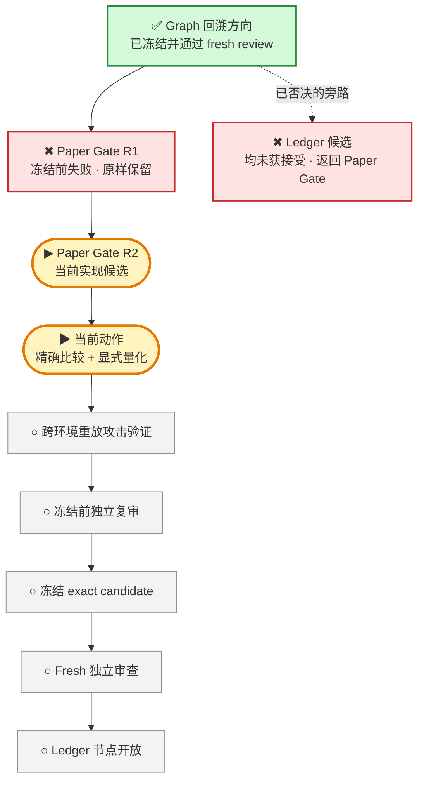

# 投研纪律系统｜当前 Graph

> 这是给 Javen 查看进度的只读窗口。它不决定路线，也不构成验收；权威路线仍由冻结的 Mission Graph 和 Product Capability Graph 控制。

## 现在在哪

一句话：项目没有停；Graph 仍把工作锁在 **Paper Gate**。R2 的冻结前审查先发现环境精度会改变结果，新的审查又证明固定有限精度仍会静默舍入或下溢；该方案已放弃，当前改为精确比较和显式量化，尚未冻结，也没有开放 Ledger。

## 项目目标与产品主路径

## 当前状态

- 更新时间：`2026-07-30T03:50:19-0700`
- 执行状态：`RUNNING`
- Graph 当前节点：`CAP-PAPER-GATE-INTEGRITY`
- 当前实现：`Paper Gate R2`
- 当前根因：环境 Decimal context 和固定有限精度都会静默改变已批准的精确经济输入。
- 当前动作：风险阈值改为精确整数系数比较；cash、position、fill 只在项目既有 quantum 上显式 `ROUND_HALF_EVEN`，并复演阈值舍入、正输入零金额和跨环境重放攻击。
- 当前候选：`尚无可冻结候选`
- Ledger：`未开放`
- 用户参与：`当前不需要`

## 权威来源

- 全项目路线：`governance/PROJECT_MISSION_GRAPH_V2.json`
- 产品能力依赖：`governance/PRODUCT_CAPABILITY_GRAPH_V1.json`
- 当前节点边界：`governance/PAPER_GATE_STATE_MACHINE_BOUNDARY_V1.json`
- 当前冻结 Graph 基线：`23ffe3dc67d17fde1e42fc53ac845945849f4dd2`

本页只在阶段切换、候选冻结、fresh review 完成、真实阻塞或项目完成时更新；普通测试与局部思考不写入。
