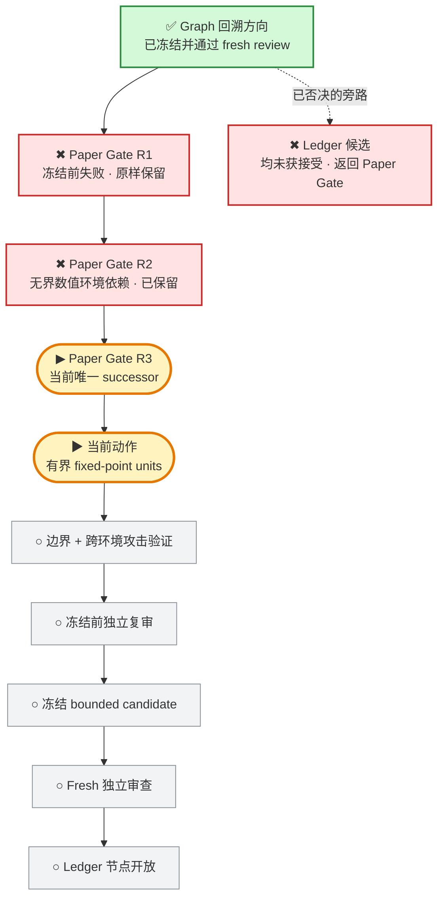
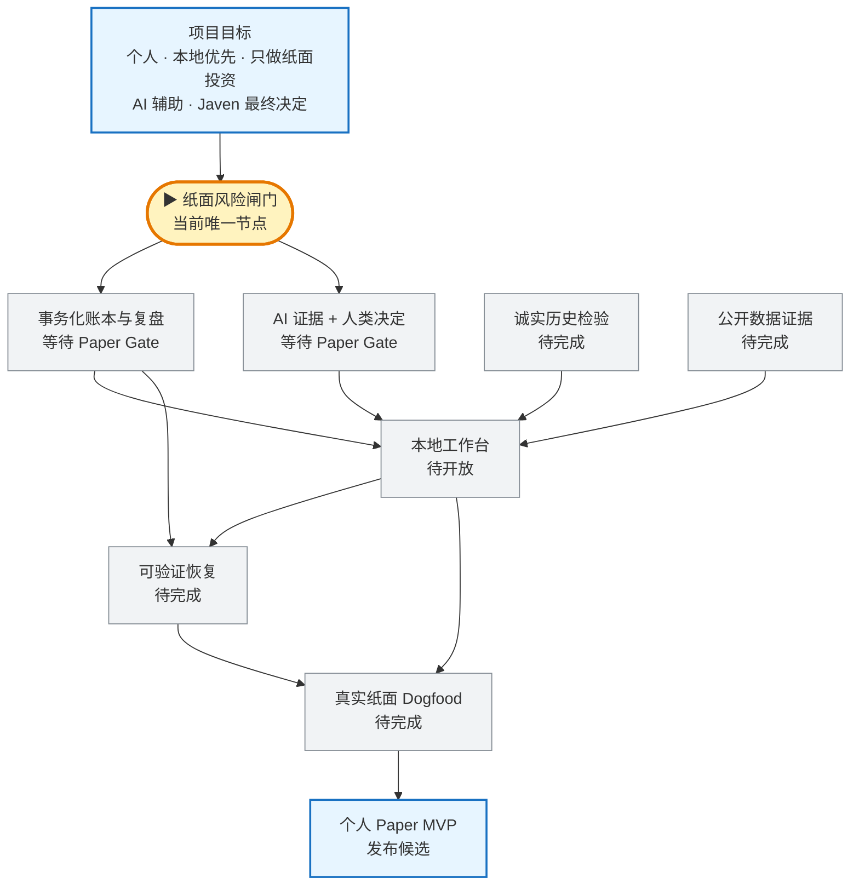

# 投研纪律系统｜当前 Graph

> 这是给 Javen 查看进度的只读窗口。它不决定路线，也不构成验收；权威路线仍由冻结的 Mission Graph 和 Product Capability Graph 控制。

## 现在在哪

一句话：项目没有停；Graph 仍把工作锁在 **Paper Gate**。R2 的两路独立冻结前审查都复现了同一权威输入会随 Python 进程设置产生不同终态，因此 R2 已作为失败快照保留。当前已换控制层到 R3：先把输入规范化为有界 fixed-point units，再进入 canonical approval、整数 reducer 和 SQLite INTEGER 重放；尚未冻结，也没有开放 Ledger。

## 项目目标与产品主路径

## 当前状态

- 更新时间：`2026-07-30T04:11:54-0700`
- 执行状态：`RUNNING`
- Graph 当前节点：`CAP-PAPER-GATE-INTEGRITY`
- 当前实现：`Paper Gate R3 bounded fixed-point successor`
- 已保留失败快照：`1afc87d2df802efd1563ce9c43c1b0cb7efcf7c4`
- R2 失败收据：`/private/tmp/PAPER_GATE_R2_1AFC87D.prefreeze-failure.json`
- 当前根因：允许无界 Decimal 进入权威状态机，会让进程级整数转换限制改变 canonical 结果、durable terminal 和重放能力。
- 当前动作：在任何 canonical expansion 或大整数构造前，把 price、quantity、money、fee、ratio 映射到项目既有 quantum 的有界 units；之后只允许受检整数运算与 SQLite INTEGER 存储。
- 当前候选：`尚无可冻结候选`
- Ledger：`未开放`
- 用户参与：`当前不需要`

## 权威来源

- 全项目路线：`governance/PROJECT_MISSION_GRAPH_V2.json`
- 产品能力依赖：`governance/PRODUCT_CAPABILITY_GRAPH_V1.json`
- 当前节点边界：`governance/PAPER_GATE_STATE_MACHINE_BOUNDARY_V1.json`
- 当前冻结 Graph 基线：`23ffe3dc67d17fde1e42fc53ac845945849f4dd2`

本页只在阶段切换、候选冻结、fresh review 完成、真实阻塞或项目完成时更新；普通测试与局部思考不写入。
