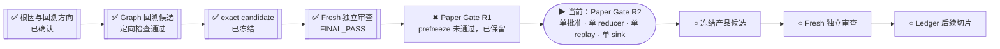

# 投研纪律系统｜当前执行进度

> 这是只读派生视图，不是 Mission Graph、验收证据、路线授权或用户决定来源。
> 若本页与冻结候选或项目 Graph 冲突，以冻结对象和 Graph 为准。

## 一眼看进度

当前不是“项目停了”，也不是“继续修 Ledger”：R1 在冻结前发现同根 authority
overlap，已经原样保留；R2 从已通过审查的 Graph 基线重新收敛唯一权威。

## 项目 Mission Graph（产品主路径）

`▶` 是 Graph 当前唯一主节点；`PENDING` 只是依赖未闭合，不表示失败。

## 当前观察

- 更新时间：`2026-07-30T02:16:06-07:00`
- 执行状态：`RUNNING`
- 当前阶段：`从 Graph 基线实现 Paper Gate single-authority R2`
- 当前路线判断：停止第四个 Ledger/kernel 补丁，回溯 `CAP-PAPER-GATE-INTEGRITY`
- 工作分支：`codex/paper-gate-single-authority-r2`
- 隔离 worktree：`/private/tmp/investment-paper-gate-r2.bKnnTF/vault/MyBrain/projects/investment-discipline-system`
- 当前实现基线：`23ffe3dc67d17fde1e42fc53ac845945849f4dd2`
- Graph 冻结基线：`23ffe3dc67d17fde1e42fc53ac845945849f4dd2`
- R1 失败快照：`294e92b2d53c024dd99d1f787dd6e82f0926081d`
- 当前产品冻结候选：`尚无`
- 用户参与：`当前不需要`

## 已经完成

- 校验并恢复接力上下文，没有在 main 重做。
- 冻结并保留三个 Ledger 失败候选；没有做第四个字段补丁。
- 两份独立方向检查均判定唯一回溯目标为 `CAP-PAPER-GATE-INTEGRITY`。
- 验证旧 Paper Gate evidence 在 prototype 改变后仍被 Graph 当作 complete。
- 复演 SQLite 同 ID 语义回归：首次风险拒绝后，替换 intent 可被接受。
- 已生成有界方向审查记录与 Paper Gate 状态机边界契约；尚未宣称验收。
- Graph 定向测试、Mission Graph、Product Graph、派生视图和精确 current-work
  检查均已通过。
- exact Graph 回溯候选已冻结为
  `23ffe3dc67d17fde1e42fc53ac845945849f4dd2`；prototype subtree 未改变。
- 未参与构造的 fresh reviewer 对冻结原件给出 `FINAL_PASS`，没有 Critical、
  Major 或 Minor finding；通过上限仅为 Graph 回退与有界实现交接。
- R1 prefreeze review 发现旧公开 replay、新提交前验证和人工批准仍有分裂权威；
  R1 已作为失败样本冻结保存，没有被当作 acceptance candidate。

## 正在进行

- 从已通过审查的 Graph 基线建立 R2 隔离 worktree。
- 只保留一个 canonical approval artifact、一个 reducer、一个 replay 和一个
  SQLite-backed `record_paper_commit` sink。
- replay 从冻结 envelope 和历史前缀重算转移；新 identity 在写入前先完成同一回放。
- 继续保持不新增 node、obligation、program intervention 或全局治理路线。

## 下一道门

1. 完成 R2 并通过新的 prefreeze root review。
2. 冻结 exact candidate，生成 deterministic receipt。
3. 由新的独立审查者挑战实现与反例；同根失败则按 stall/backtrack，不做字段补丁。

## 明确未完成

- R1 明确失败；R2 尚未完成、冻结或通过 fresh review。
- Ledger 节点没有完成。
- 没有 live、shadow、券商、资金、凭据、provider account 或风险规则权限。

## 本页更新规则

仅在出现以下事件时更新：阶段切换、候选冻结、fresh review 完成、真实阻塞或项目完成。
普通测试输出和局部思考不写入本页，避免制造噪声。
