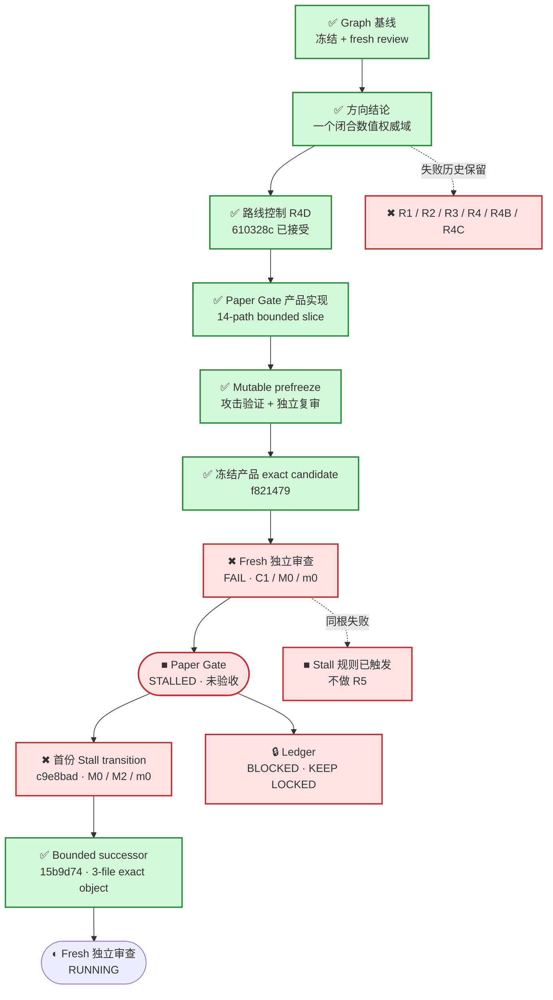
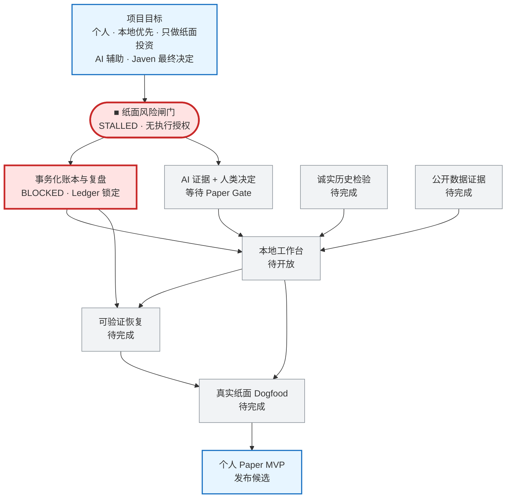

# 投研纪律系统｜当前 Graph

> 这是给 Javen 查看进度的只读窗口。它不决定路线，也不构成验收；权威路线仍由冻结的 Mission Graph 和 Product Capability Graph 控制。

## 现在在哪

一句话：exact candidate `f821479` 在 fresh source review 中出现同根 Critical；候选不接受，Paper Gate 进入 stall，Ledger 保持 blocked，不授权 R5。

## 项目目标与产品主路径

## 当前状态

- 更新时间：`2026-07-30T19:02:19-0700`
- 执行状态：`FROZEN_STALL_SUCCESSOR_UNDER_FRESH_REVIEW`
- Graph 当前节点：`CAP-PAPER-GATE-INTEGRITY`
- 当前工作项：`WORK-PAPER-GATE-SINGLE-STATE-MACHINE-R1`
- 当前义务：`OBL-PAPER-UNIQUE-COMMIT-SINK`
- 当前路线状态：`Paper Gate = STALLED；Ledger = BLOCKED；execution_authorized = false`
- R1 失败快照：`294e92b2d53c024dd99d1f787dd6e82f0926081d`
- R2 失败快照：`1afc87d2df802efd1563ce9c43c1b0cb7efcf7c4`
- R3 失败快照：`b2745910770c016327f73e749771e63626983d58`
- R3 失败收据：`/private/tmp/PAPER_GATE_R3_B274591.prefreeze-failure.json`
- R4 路线绑定失败快照：`ab021e94d94357e9a82255dbf62f3f53c60d50c0`
- R4 路线绑定失败收据：`/private/tmp/PAPER_GATE_DIRECTION_R4_AB021E9.prefreeze-failure.json`
- R4B 路线绑定失败快照：`c1a19d2f33b3a2c40b2938b5c381b10f2cd1803c`
- R4B 路线绑定失败收据：`/private/tmp/PAPER_GATE_DIRECTION_R4B_C1A19D2.prefreeze-failure.json`
- R4C 路线绑定失败快照：`40c88981942bea40502010521623d8d9fef61e58`
- R4C frozen-review 失败收据：`/private/tmp/PAPER_GATE_DIRECTION_R4C_40C8898.frozen-review-failure.json`
- 当前根因：最终 R4 仍让一个非 canonical 的时间小数形式在因果检查、identity 和 commit 前被解析器截断；这属于同一个“权威标量域未先闭合”的根因，不是孤立字段错误。
- 方向结论：`一个覆盖所有权威 numeric primitive 的 closed canonical scalar/value domain；不是 R3 字段补丁`
- 已接受的路线控制：`610328ce328834bd43c60e1cc0fa2aaa7d5866c7`
- Route-control fresh review 收据：`/private/tmp/PAPER_GATE_DIRECTION_R4D_610328C.fresh-review-pass.json`
- Mutable prefreeze：`PASS`（完整 prototype 在 `sys.int_max_str_digits=640` 与 `0` 下均为 `95 passed in 2.20s`；独立源码复审 `PASS_PREFREEZE`）
- Fresh frozen review：`FAIL_DO_NOT_ACCEPT`；`critical=1`、`major=0`、`minor=0`。
- 审查反例：实际更晚的 evidence 时间在解析后与 human decision 落入同一微秒，观察到 `status=COMMITTED`、`fills=1`。
- 首份 Stall transition：`c9e8bad088d509a012235c53701a063016796fe5`（fresh review `FAIL`；`critical=0`、`major=2`、`minor=0`；未接受）
- 首份 Stall transition 失败收据：`governance/evidence/PAPER_GATE_STALL_C9E8BAD.frozen-review-failure.json`（`4399 bytes`；SHA-256 `407e8a93e18d0cc8a0d5cc96cdeb052b1ce9ccaedc905719661b2bf88d84d6db`）
- 当前 Stall successor：`15b9d74221d045a65a66b56d5a3f0ada9d541c58`（`3 paths`；frozen；fresh review 正在进行）
- 当前 Stall successor 收据：`/private/tmp/PAPER_GATE_STALL_15B9D74.candidate.json`（`5643 bytes`；SHA-256 `b34e764cb0a2aaedd61d27254122f94281058c564a48c3c140487d34c7376d06`）
- 独立完整 clone 验证：`73 tests in 34.515s`；`95 tests in 2.146s`（digit limit `640`）；`95 tests in 2.097s`（digit limit `0`）；均 `OK`。
- 当前动作：等待新的独立审查员检查精确 `15b9d74` 对象；不修改候选，不修改 `prototype/**`。
- 当前产品写集：`14 paths`（既有 inventory；不新增 Graph、governance、authority kernel 或 parallel numeric protocol）
- 当前产品候选：`f821479111c8925220219dffd45b47e60086cb22`（frozen；rejected；保留作失败证据）
- 产品候选收据：`/private/tmp/PAPER_GATE_R4_F821479.candidate.json`（`5339 bytes`；SHA-256 `db383182fa8c379409966399c285a2ec9708898ff5ca1203dd6b89833a5eec67`）
- Frozen-review 失败收据：`governance/evidence/PAPER_GATE_R4_F821479.frozen-review-failure.json`（`4610 bytes`；SHA-256 `ef90aa5228804123563f914d4211f38ce69e327a4c8e8d7f4301f5a770893a1e`）
- Ledger：`BLOCKED / KEEP LOCKED`
- R5：`未授权`
- 用户参与：`当前不需要`

## 权威来源

- 全项目路线：`governance/PROJECT_MISSION_GRAPH_V2.json`
- 产品能力依赖：`governance/PRODUCT_CAPABILITY_GRAPH_V1.json`
- 当前节点边界：`governance/PAPER_GATE_STATE_MACHINE_BOUNDARY_V2.json`
- 当前冻结 Graph 基线：`23ffe3dc67d17fde1e42fc53ac845945849f4dd2`

本页只在阶段切换、候选冻结、fresh review 完成、真实阻塞或项目完成时更新；普通测试与局部思考不写入。
