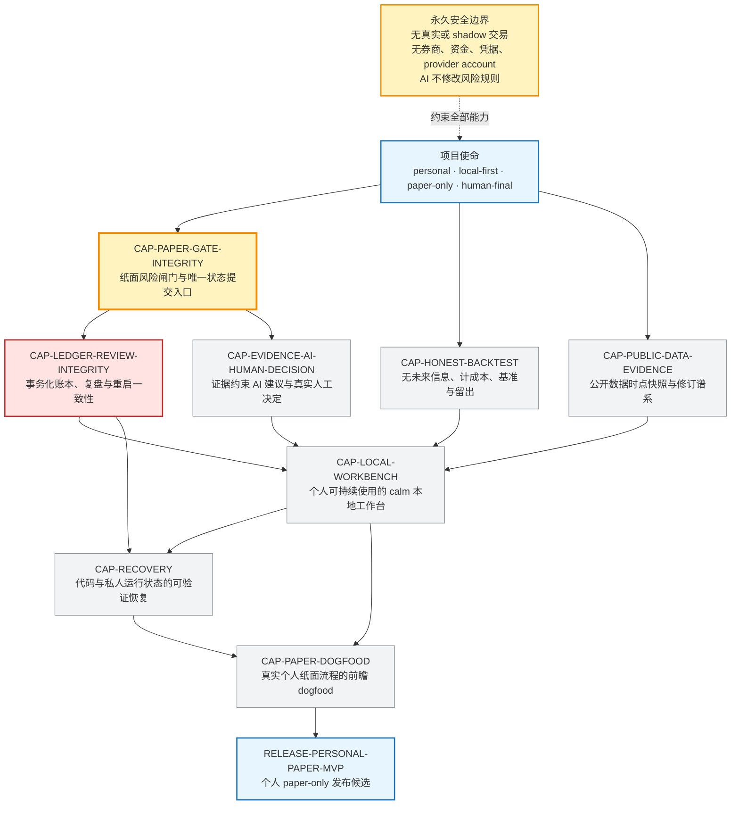

# 投研纪律系统｜固定蓝图与当前指针

> 这是给 Javen 查看进度的只读窗口，不决定路线、不授权执行、不构成验收。

## 这个页面以后怎么变

- **固定蓝图不随日常工作重画。** 下方产品能力节点和依赖来自 `IDS-PERSONAL-PAPER-PRODUCT-CAPABILITIES-V1`。
- **固定交付链不增删步骤。** 今后只移动当前高亮、更新证据和时间。
- 只有项目目标或能力依赖真的改变，并形成新的权威 Graph 版本时，蓝图结构才会改变；届时必须单独说明“为什么改版”。
- 调试反例、失败根因和历史回溯不再长进主图，只写在本页后面的当前证据或项目 evidence 中。

## 固定产品蓝图

**固定结构中的当前位置：** `CAP-PAPER-GATE-INTEGRITY`。它没有验收，所以依赖它的 Ledger 仍是 `BLOCKED`。

## 固定交付链与当前阶段

```mermaid
flowchart LR
    E0["E0<br/>方向已选"] --> E1["E1<br/>Mutable 候选"]
    E1 --> E2["E2<br/>预冻结独立审查"]
    E2 --> E3["E3<br/>冻结 exact C"]
    E3 --> E4["E4<br/>Fresh exact review"]
    E4 --> E5["E5<br/>单收据 activation A"]
    E5 --> E6["E6<br/>本机 authority registration"]
    E6 --> E7["E7<br/>check-work → start-work"]
    E7 --> E8["E8<br/>实现与节点验收"]
    E8 --> E9["E9<br/>移动到下一能力"]

    classDef done fill:#d3f9d8,stroke:#2b8a3e,stroke-width:2px;
    classDef current fill:#e7f5ff,stroke:#1971c2,stroke-width:3px;
    classDef pending fill:#f1f3f5,stroke:#868e96;
    class E0,E1,E2,E3 done;
    class E4 current;
    class E5,E6,E7,E8,E9 pending;
```

**当前指针：`E4｜Fresh exact review`。**

完成 E4 不等于完成项目；它只决定冻结的 12-path Graph 候选能否增加一份独立审查收据。只有依次通过 E5–E7，才获得第一次 Paper Gate 产品编辑授权。Paper Gate 完成并验收后，固定产品蓝图中的指针才会移动到 Ledger。

## 当前事实

- 更新时间：`2026-07-31T04:58:59-07:00`
- 当前 Graph 节点：`CAP-PAPER-GATE-INTEGRITY`
- 当前候选工作：`WORK-PAPER-GATE-INTEGER-AUTHORITY-R1`
- 当前义务：`OBL-PAPER-UNIQUE-COMMIT-SINK`
- 候选阶段：`frozen_candidate`
- 冻结 candidate C：`aebbbbc15c065cc957ed41a581de1fc8d3324519`
- 候选写集：要求 `12 paths`；实际 `12 paths`
- 当前状态：`candidate_valid=true`；`execution_authorized=false`
- 当前 accepted authority：`Paper Gate = STALLED`；`Ledger = BLOCKED`
- 生产 registration：不存在
- 生产 attempt ref `refs/ids-attempts/paper-gate-integer-authority-r1`：不存在
- Ledger 产品写集：`NONE_AUTHORIZED`
- E2 最终结论：`GO_FREEZE_C — Critical 0 / Major 0 / Minor 0`
- 当前动作：在完整 `--no-local`、non-promisor clone 中审查 exact C
- 当前 reviewer：`/root/integer_authority_graph_exact_review`

## 当前候选正在重新证明什么

- 项目级 `AGENTS.md` 已要求：只有冻结且通过独立审查的 Graph 候选，才可能通过后续 `check-work` 启动链；Graph 只能版本化修订，不能按进展原地改写。
- `HEAD tree ↔ stage-0 index ↔ worktree literal bytes + owner execute mode` 使用同一中央 Gate。
- tracked 原始一致性不再依赖 Git `status` 或 `diff` 自报 clean。
- 当前补强项：ignored prototype、mutable added file、physical index、canonical receipt、handoff 指定 original common directory。
- `register-authority` 与 `check-work` 不授权；只有一次成功的 `start-work` 能原子消费 attempt ref。
- 安全边界保持 `personal/local-first/paper-only/human-final`。

## 当前验证证据

- Graph，`PYTHONINTMAXSTRDIGITS=640`：`76 tests in 1327.360s`，`OK`
- Graph，`PYTHONINTMAXSTRDIGITS=0`：`76 tests in 1329.978s`，`OK`
- Prototype，`PYTHONINTMAXSTRDIGITS=640`：`95 tests in 3.234s`，`OK`
- Prototype，`PYTHONINTMAXSTRDIGITS=0`：`95 tests in 4.536s`，`OK`
- Fresh mutable prefreeze review：`GO_FREEZE_C — Critical 0 / Major 0 / Minor 0`
- Product 与 Mission 的冻结态 `check-candidate`：PASS；`execution_authorized=false`
- Frozen candidate C 的 fresh exact-object review：运行中
- `git diff --check`：PASS
- tracked `prototype/**` diff：空

## E4 之后固定怎么走

1. E4 从完整 `--no-local`、non-promisor clone 完成 fresh exact-object review。
2. E5 只增加一份 fresh-review receipt，形成 activation A。
3. E6 在 handoff 指定的唯一 Git common directory 注册本机 authority。
4. E7 先 `check-work`，再由一次 `start-work` 原子消费 attempt。
5. E8 才允许 Paper Gate 产品文件首次移动并接受节点级验收。
6. Paper Gate 验收后，固定产品蓝图指针移动到 Ledger；蓝图本身不重画。

## 权威入口

- 项目工作规则：`AGENTS.md`
- 全项目路线：`governance/PROJECT_MISSION_GRAPH_V2.json`
- 固定产品能力依赖：`governance/PRODUCT_CAPABILITY_GRAPH_V1.json`
- 当前候选边界：`governance/PAPER_GATE_STATE_MACHINE_BOUNDARY_V3.json`
- 当前方向提案：`governance/evidence/PAPER_GATE_INTEGER_AUTHORITY_DIRECTION_R1.proposal.json`
- 当前方向审查：`governance/evidence/PAPER_GATE_INTEGER_AUTHORITY_DIRECTION_R1.fresh-review-pass.json`

以后本页只更新：**当前指针、节点状态、证据、时间**。蓝图结构变化必须作为单独的版本决策说明。
