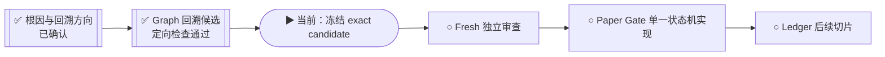
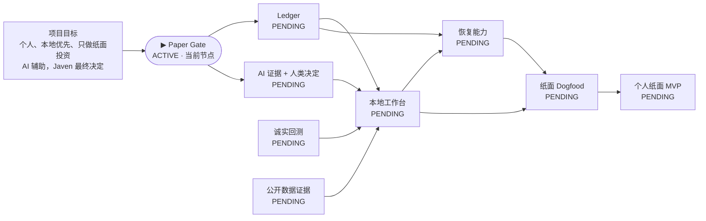

# 投研纪律系统｜当前执行进度

> 这是只读派生视图，不是 Mission Graph、验收证据、路线授权或用户决定来源。
> 若本页与冻结候选或项目 Graph 冲突，以冻结对象和 Graph 为准。

## 一眼看进度

当前不是“项目停了”，也不是“继续修 Ledger”：现在正把已经验证的 Graph
回溯候选冻结成不可变对象，随后交给未参与构造的审查者。

## 项目 Mission Graph（产品主路径）

`▶` 是 Graph 当前唯一主节点；`PENDING` 只是依赖未闭合，不表示失败。

## 当前观察

- 更新时间：`2026-07-30T01:00:03-07:00`
- 执行状态：`RUNNING`
- 当前阶段：`冻结已通过定向检查的 Paper Gate Graph 回溯候选`
- 当前路线判断：停止第四个 Ledger/kernel 补丁，回溯 `CAP-PAPER-GATE-INTEGRITY`
- 工作分支：`codex/paper-gate-boundary-r1`
- 隔离 worktree：`/private/tmp/investment-paper-gate-backtrack-r1.uoDVNC/vault/MyBrain/projects/investment-discipline-system`
- 基线：`931817a0251bef1ad3975afee7ad06f59aedf06a`
- 用户参与：`当前不需要`

## 已经完成

- 校验并恢复接力上下文，没有在 main 重做。
- 冻结并保留三个 Ledger 失败候选；没有做第四个字段补丁。
- 两份独立方向检查均判定唯一回溯目标为 `CAP-PAPER-GATE-INTEGRITY`。
- 验证旧 Paper Gate evidence 在 prototype 改变后仍被 Graph 当作 complete。
- 复演 SQLite 同 ID 语义回归：首次风险拒绝后，替换 intent 可被接受。
- 已生成有界方向审查记录与 Paper Gate 状态机边界契约；尚未宣称验收。
- Graph 定向测试、Mission Graph、Product Graph、派生视图和精确 current-work
  检查均已通过；候选尚未冻结提交。

## 正在进行

- 核对候选的精确写集并冻结 commit/tree。
- 准备交给未参与构造的 fresh reviewer 做原件审查。
- 继续保持不新增 node、obligation、program intervention 或全局治理路线。

## 下一道门

1. 冻结 exact Graph 回溯候选。
2. 由未参与构造的上下文做 fresh review。
3. 只有 review 通过，才开始单一 `record_paper_commit` 产品实现。

## 明确未完成

- Graph 指针尚未冻结提交。
- Paper Gate 新实现尚未开始。
- Ledger 节点没有完成。
- 没有 live、shadow、券商、资金、凭据、provider account 或风险规则权限。

## 本页更新规则

仅在出现以下事件时更新：阶段切换、候选冻结、fresh review 完成、真实阻塞或项目完成。
普通测试输出和局部思考不写入本页，避免制造噪声。
