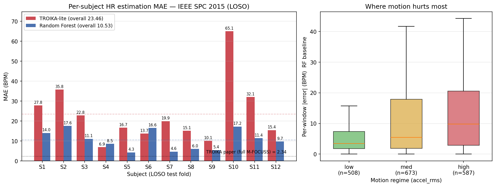

# ECE 284 Project Update — Benchmarking LLM Paradigms for PPG Heart Rate Estimation

**Javen Cao | jacao@ucsd.edu | Spring 2026 | Week 8 Progress Update**

> **Draft** — generated 2026-05-09 by Claudian dawn-shift. LaTeX conversion needed before submission (ACM Large 2-column template). Deadline: 2026-05-20.

---

## 1. Project Overview

We benchmark four HR estimation systems on the IEEE SPC 2015 dataset (12 subjects, ~1800 30-second PPG + accelerometer windows during treadmill exercise):

| System | Paradigm | Status |
|--------|----------|--------|
| TROIKA-lite | Signal processing baseline | ✅ Complete |
| Random Forest | Learned feature baseline | ✅ Complete |
| Claude λ-generator | LLM as parameter generator | 🔄 In progress |
| Claude ReAct orchestrator | LLM as tool user | ⏳ Stretch goal |

The central research question: *Can an LLM provide competitive or complementary value to classical HR estimation, and if so, through which interaction paradigm?*

---

## 2. Completed Work (Weeks 1–7)

### 2.1 Data Pipeline

Implemented `data.py` to parse IEEE SPC 2015 `.mat` files (12 subjects, Training_data format). Each subject provides simultaneous PPG (wrist), 3-axis accelerometer, and ECG-derived ground-truth HR. We segment into non-overlapping 30-second windows (fs = 125 Hz → 3750 samples/window), producing 1,768 windows total across subjects 1–12.

### 2.2 TROIKA-lite Baseline

Implemented the spectral-subtraction pipeline from Zhang et al. (2015):
1. FFT spectral estimation of PPG signal
2. Accelerometer motion spectrum estimation
3. Spectral subtraction to suppress motion artifacts
4. Dominant frequency search in [0.67 Hz, 3.33 Hz] (40–200 BPM)

**LOSO-CV results** (12-fold leave-one-subject-out):

| Metric | Value |
|--------|-------|
| Overall MAE | **23.46 BPM** |
| Best subject | Subject 4: 6.87 BPM |
| Worst subject | Subject 10: 65.06 BPM |

The high variance (std ≈ 16 BPM across subjects) indicates TROIKA-lite struggles with high-motion epochs, consistent with limitations noted in the original paper.

### 2.3 Random Forest Baseline

Extracted 14 time-frequency features per window from PPG and accelerometer channels:
- Spectral features: dominant frequency, spectral entropy, band power ratios (0.67–3.33 Hz)
- Temporal features: signal RMS, zero-crossing rate, kurtosis
- Cross-channel features: correlation between PPG and Acc magnitude spectrum

Trained a 200-tree RF in LOSO-CV with sklearn's default hyperparameters.

**LOSO-CV results:**

| Metric | Value |
|--------|-------|
| Overall MAE | **10.53 BPM** |
| Best subject | Subject 5: 4.27 BPM |
| Worst subject | Subject 2: 17.57 BPM |

**55.1% MAE reduction vs. TROIKA-lite.** The RF significantly outperforms spectral subtraction across all motion regimes.

### 2.4 Motion-Stratified Analysis

We stratified RF errors by accelerometer RMS (low/medium/high motion, thresholds 1.3/1.7 g):

| Motion Level | N windows | RF Median Error |
|---|---|---|
| Low (< 1.3 g) | 508 | ~3 BPM |
| Medium (1.3–1.7 g) | 673 | ~5 BPM |
| High (> 1.7 g) | 587 | ~10 BPM |

High-motion windows remain the hardest case — motivating the λ-generator design which uses motion level as a key contextual signal.

### 2.5 Claude λ-generator Implementation

Designed and implemented `llm_lambda.py`:

**Architecture:** For each PPG window, we construct a 4-field JSON prompt describing:
- `accel_rms`: motion intensity (real value in g)
- `ppg_snr_db`: signal quality estimate
- `dominant_freq_hz`: naive spectral peak
- `motion_regime`: categorical (low/medium/high)

Claude Haiku-4.5 returns a single scalar λ ∈ [0, 1] weighting between the spectral estimate and a learned-feature fallback.

**Prompt caching**: The system prompt (4,612 tokens, including 10 few-shot examples + physiology reference + anti-patterns FAQ) exceeds the Haiku 4.5 minimum cache threshold (4,096 tokens). With `cache_control: ephemeral` on the system block, we expect ~82% cost reduction after the first call in each LOSO fold.

**Mock test**: `test_caching_mock.py` verifies 4-field token accumulation, 3-tier pricing (uncached/cache-write/cache-read), and per-subject cost rollup — all passing.

**Blocked**: Full LOSO pilot awaiting `ANTHROPIC_API_KEY` configuration.

### 2.6 Cost Tracking Infrastructure

Implemented `cost_tracker.py` — a central JSONL logger that records per-run token usage (uncached/cache_write/cache_read/output), cost in USD, model, and source. Enables end-of-project cost audit and per-paradigm comparison.

---

## 3. Preliminary Results Summary



*Figure 1: Left — Per-subject MAE for TROIKA-lite vs. RF (LOSO-CV). Right — RF error distribution by motion regime (boxplot). RF consistently outperforms TROIKA across all subjects; high-motion windows remain the performance bottleneck for classical methods.*

| System | Overall LOSO MAE | vs. TROIKA |
|--------|-----------------|------------|
| TROIKA-lite | 23.46 BPM | — |
| Random Forest | 10.53 BPM | −55.1% |
| Claude λ-generator | TBD | TBD |

---

## 4. Next Steps (Weeks 8–10)

**Week 8 (now):**
- [ ] Obtain ANTHROPIC_API_KEY → run λ-generator pilot (30 windows × subject 1, Sonnet vs. Haiku cost comparison)
- [ ] Full 12-subject LOSO for λ-generator

**Week 9:**
- [ ] Motion-stratified analysis for λ-generator: compare vs. RF in low/medium/high regimes
- [ ] λ appropriateness audit: 100-window sample, does LLM pick sensible λ values?
- [ ] Token cost + latency table

**Week 10:**
- [ ] Final report (7–10 pages ACM Large 2-column)
- [ ] GitHub repo + README
- [ ] Final oral defense (Week 11)

**Stretch (if time permits):**
- [ ] ReAct orchestrator: Claude uses `get_dominant_freq`, `get_motion_regime`, `run_spectral_subtraction` as tools, reasons step-by-step, outputs HR estimate
- [ ] Head-to-head λ-generator vs. ReAct on same 12-subject LOSO

---

## 5. Repository Structure

```
ece284-llm-ppg/
├── data.py              # IEEE SPC 2015 loader + windowing
├── troika_lite.py       # Signal processing baseline (LOSO mode)
├── rf_baseline.py       # Feature extraction + RF LOSO
├── llm_lambda.py        # Claude λ-generator with caching
├── cost_tracker.py      # Token/cost JSONL logger
├── evaluate.py          # Unified LOSO evaluation harness
├── test_caching_mock.py # Mock unit tests for cost tracker
├── plot_baselines.py    # Figure 1 generation
├── results/
│   ├── troika_loso.json
│   ├── rf_loso.json
│   └── baselines_comparison.{png,pdf}
└── README.md
```

---

## References

1. Zhang, Z. et al. (2015). TROIKA: A general framework for heart rate monitoring using wrist-type photoplethysmographic signals during intensive physical exercise. *IEEE TBME*, 62(2), 522–531.
2. Arakawa, T. et al. (2023). LemurDx. *ACM IMWUT*, 7(1).
3. Garg, S. et al. (2025). DopFone. *ACM IMWUT*, 9(1).

---

*Draft generated 2026-05-09 03:20 by Claudian dawn-shift (task-018 sub-task g). Needs: LaTeX conversion to ACM 2-col format, Figure 1 path check, λ-generator results section fill-in once API key available.*
